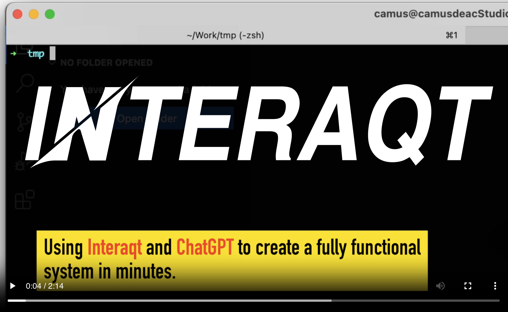
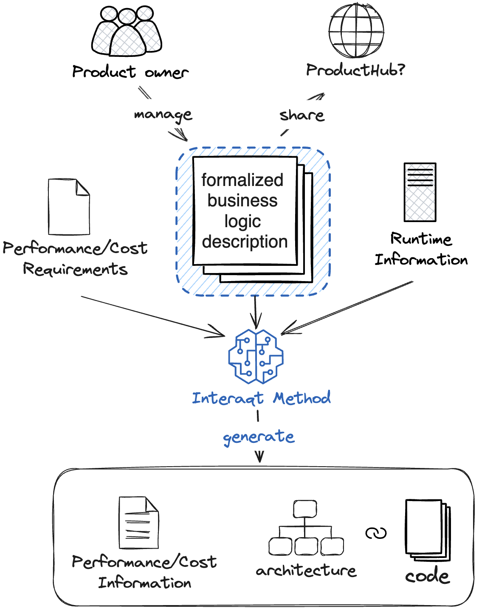
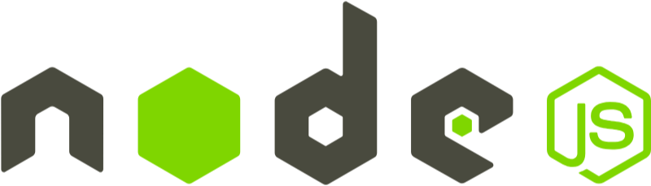
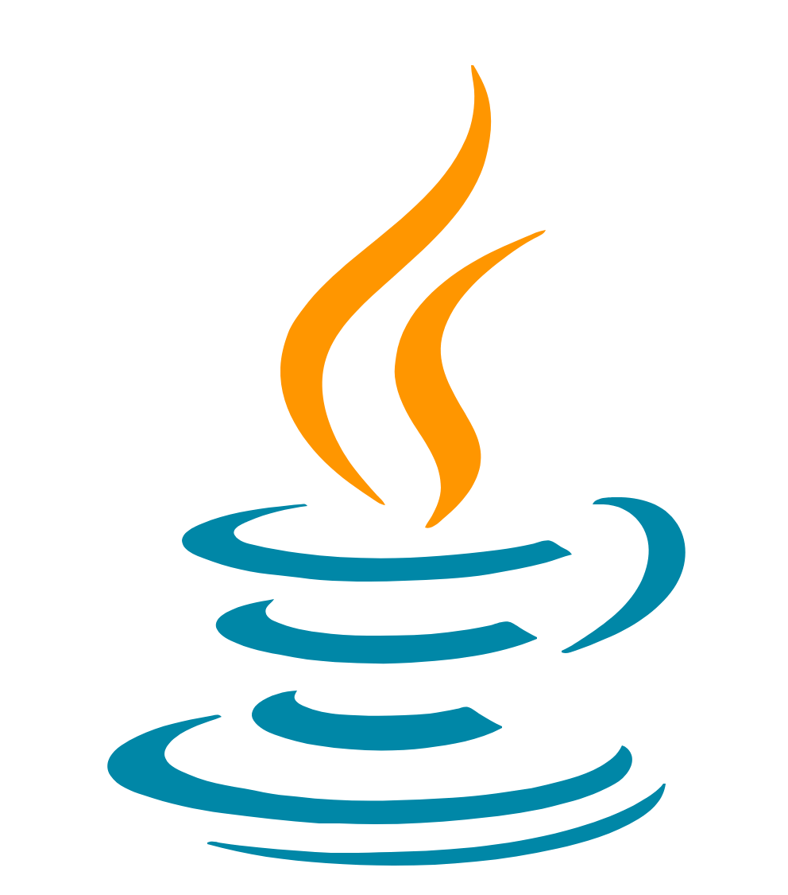

<p align="center">
  
</p>


<p align="center">
Better application framework for LLM era.
</p>

<p align="center">
<a href="https://interaqt.dev">https://interaqt.dev</a>
</p>

# 1. What is Interaqt?

Interaqt is a project dedicated to separating application business logic from its specific implementation. 
It offers a revolutionary and rigorously structured data model for articulating business logic, 
alongside a suite of tools that automatically decide and implement software architecture based on this logic, 
directly providing usable APIs. Interaqt aims to liberate individuals and teams from the constraints of implementation specifics, 
performance requirements, and cost demands, allowing them to concentrate on the articulation of business logic and expedite application development. 
We also believe that this approach is optimal in the era of large language models (LLMs). 
Compared to generating code with LLMs, building intermediate data structures eliminates the uncertainty in generated systems, 
enabling true independence from engineering involvement unless specific capabilities are required.

# 2. Features

## 2.1 Better Abstractions
Moving beyond MVC, Interaqt embraces entities, interactions, and activities for an intuitive business logic alignment.
This simplifies database design, permissions, and data management, cutting down 80% of non-essential technicalities for developers.

Interaqt's principles reflect natural language, enabling immediate use of ChatGPT for business logic description without extra training.
Quickly create a fully operational system with Interaqt's streamlined process. Checkout the video or tutorial to see how it works.


<p align="center">
    <a href="https://interaqt.dev"></a>
</p>

## 2.2 Reactivity In Backend
Interaqt transforms backend development with reactive programming,
prioritizing data definition over manipulation.
Its approach to reactive data ensures efficient incremental calculations and peak performance in all scenarios.

<p align="center">
  
</p>

## 2.3 Automatic Architecture Design
Performance and cost considerations are distinct from business logic in Interaqt's design.
It specializes in automated architecture, dynamically adapting to user and data expansion.

<p align="center">
  
</p>

## 2.4 Multiple language support
Interaqt's abstraction transcends specific programming languages. The NodeJS iteration of Interaqt is now available for use. Anticipate the launch of its Go, Python, and Java versions in the summer of 2024!

<table>
<tbody>
<tr>
<td width="25%" align="center"></td>
<td width="25%" align="center"></td>
<td width="25%" align="center"></td>
<td width="25%" align="center"></td>
</tr>
</tbody>
</table>

# 3. Components of Interaqt
| Component                | Description                                                                   | Status                                                           |
|--------------------------|-------------------------------------------------------------------------------|------------------------------------------------------------------|
| Interaqt IDE             | Visual editor for processes, data, and more.                                  | 🚧Release on August 2024                                         | 
| Interaqt Runtime(NodeJS) | NodeJS runtime that automatically builds databases and generates usable APIs. |  |
| Interaqt Runtime(Go)     | Go runtime.                                                                   | 🚧Release on August 2024                                         |
| Interaqt Runtime(Java)   | Java runtime.                                                                 | 🚧Release on August 2024                                         |

# 4. Getting Started with Interaqt

```bash
npx create-interaqt-app myapp
```

Visit our website for more details.

[https://interaqt.dev](https://interaqt.dev)

# 5. Support Us
We invite you to subscribe to our release event or star our project on GitHub.
Your valuable feedback will help us launch even faster!

# 6. Contributing

All of Interaqt's code is open source, and we welcome contributions in any form. If you have any ideas or find any bugs at this stage, please let us know through an [Issue](https://github.com/InteraqtDev/interaqt/issues).