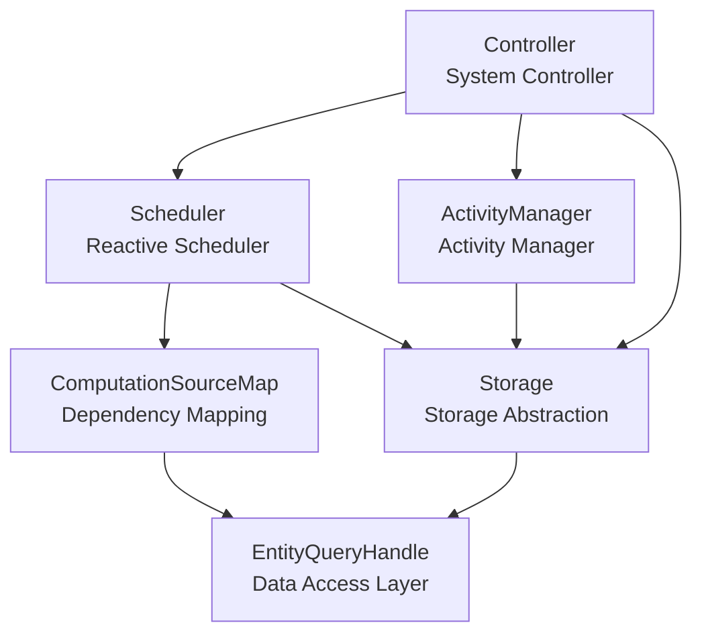

# Chapter 1: Architecture Design

This chapter provides a detailed introduction to the overall architecture design of the interaqt framework, including module division, data flow, and relationships between core components.

## 1.1 Overall Architecture

### Module Division

The interaqt framework adopts a three-layer architecture design, with each layer having clear responsibilities:

```
┌─────────────────────────────────────────────────────────────┐
│                      Application Layer                       │
│                   (User Business Code)                       │
└─────────────────────────────────────────────────────────────┘
                                │
┌─────────────────────────────────────────────────────────────┐
│                      Runtime Layer                          │
│  ┌─────────────┐  ┌─────────────┐  ┌─────────────────────┐  │
│  │ Controller  │  │ Scheduler   │  │ ActivityManager     │  │
│  │             │  │             │  │                     │  │
│  │ - Coordinate│  │ - Reactive  │  │ - Activity State    │  │
│  │   Layers    │  │   Computation│  │   Management       │  │
│  │ - Interaction│  │ - Dependency │  │ - Interaction      │  │
│  │   Calls     │  │   Tracking   │  │   Orchestration    │  │
│  │ - Transaction│  │ - Incremental│  │ - Transaction      │  │
│  │   Management │  │   Computation│  │   Processing       │  │
│  └─────────────┘  └─────────────┘  └─────────────────────┘  │
└─────────────────────────────────────────────────────────────┘
                                │
┌─────────────────────────────────────────────────────────────┐
│                      Storage Layer                          │
│  ┌─────────────────┐  ┌─────────────────┐  ┌─────────────┐  │
│  │ EntityQueryHandle│  │ MatchExp        │  │ RecordQuery │  │
│  │                 │  │                 │  │             │  │
│  │ - Unified Data  │  │ - Query         │  │ - Query     │  │
│  │   Access        │  │   Expression    │  │   Building  │  │
│  │ - Filtered      │  │ - Condition     │  │ - SQL       │  │
│  │   Entity Support│  │   Combination   │  │   Generation│  │
│  │ - Relation      │  │ - Type Safety   │  │ - Performance│ │
│  │   Operations    │  │                 │  │   Optimization│ │
│  └─────────────────┘  └─────────────────┘  └─────────────┘  │
└─────────────────────────────────────────────────────────────┘
                                │
┌─────────────────────────────────────────────────────────────┐
│                      Shared Layer                           │
│  ┌─────────────┐  ┌─────────────┐  ┌─────────────────────┐  │
│  │ Entity      │  │ Activity    │  │ ComputedData        │  │
│  │ Property    │  │ Interaction │  │ Attributive         │  │
│  │ Relation    │  │ Transfer    │  │ BoolExp             │  │
│  └─────────────┘  └─────────────┘  └─────────────────────┘  │
└─────────────────────────────────────────────────────────────┘
                                │
┌─────────────────────────────────────────────────────────────┐
│                    Database Layer                           │
│          SQLite │ PostgreSQL │ MySQL │ PGLite              │
└─────────────────────────────────────────────────────────────┘
```

### Data Flow

Data flow in the framework follows reactive programming paradigms, where data changes automatically trigger related computations:

```
User Interaction
        │
        ▼
┌─────────────────┐
│ ActivityManager │ ◄─── Permission Check (Attributive)
│                 │
│ - Validate      │
│   Permissions   │
│ - Execute       │
│   Business Logic│
│ - Generate      │
│   Change Events │
└─────────────────┘
        │
        ▼ (RecordMutationEvent)
┌─────────────────┐
│ Storage Layer   │
│                 │
│ - Persist Data  │
│ - Trigger Change│
│   Events        │
└─────────────────┘
        │
        ▼ (MutationEvent)
┌─────────────────┐
│ Scheduler       │
│                 │
│ - Dependency    │
│   Analysis      │
│ - Computation   │
│   Scheduling    │
│ - Incremental   │
│   Updates       │
└─────────────────┘
        │
        ▼ (ComputationResult)
┌─────────────────┐
│ Controller      │
│                 │
│ - Apply         │
│   Computation   │
│   Results       │
│ - Update Storage│
│ - Trigger       │
│   Side Effects  │
└─────────────────┘
```

### Core Component Relationships



## 1.2 Runtime Module

The Runtime module is the core execution engine of the framework, responsible for reactive computation, interaction handling, and activity management.

### Reactive Engine Design

The core of the reactive engine is the **Scheduler**, which implements the complete reactive computation mechanism:

```typescript
// Core component relationships
export class Scheduler {
    computations = new Set<Computation>()
    private sourceMapManager: ComputationSourceMapManager
    
    constructor(
        public controller: Controller,
        entities: KlassInstance<typeof Entity>[],
        relations: KlassInstance<typeof Relation>[],
        dict: KlassInstance<typeof Property>[]
    ) {
        // Scan all computation definitions in entities, relations, and dictionaries
        // Create corresponding Computation instances for each computation
        // Establish data dependency relationship mapping
    }
}
```

**Core Mechanisms of Reactive Computation:**

1. **Dependency Collection**: During system initialization, Scheduler scans all computation definitions and establishes `DataDep` dependency relationships
2. **Change Monitoring**: Monitor data change events through `ComputationSourceMapManager`
3. **Incremental Computation**: When data changes, only recompute affected parts
4. **Result Application**: Apply computation results to the storage layer

### Scheduler

Scheduler is the core of the reactive engine, responsible for:

#### Computation Discovery and Registration
```typescript
// Discover computations from entity definitions
entities.forEach(entity => {
    if (entity.computedData) {
        // Entity-level computations
        computationInputs.push({
            dataContext: {type: 'entity', id: entity},
            args: entity.computedData
        })
    }
    
    // Property-level computations
    entity.properties?.forEach(property => {
        if (property.computedData) {
            computationInputs.push({
                dataContext: {type: 'property', host: entity, id: property.name},
                args: property.computedData
            })
        }
    })
})
```

#### Dependency Relationship Establishment
```typescript
// Establish dependency relationships for each computation
for(const computationInput of computationInputs) {
    const ComputationCtor = ComputedDataHandle.Handles.get(args.constructor)![dataContext.type]
    const computation = new ComputationCtor(this.controller, args, dataContext)
    
    // Register with scheduler
    this.computations.add(computation)
}
```

#### Asynchronous Computation Support
The framework supports asynchronous computations. Scheduler automatically creates task tables for async computations:

```typescript
if(this.isAsyncComputation(computation)) {
    // Create dedicated task entity for async computations
    const AsyncTaskEntity = Entity.create({
        name: this.getAsyncTaskRecordKey(computation),
        properties: [
            Property.create({ name: 'status', type: 'string' }),
            Property.create({ name: 'args', type: 'json' }),
            Property.create({ name: 'result', type: 'json' })
        ]
    })
}
```

### Controller

Controller is the system's main coordinator, connecting various modules:

```typescript
export class Controller {
    public scheduler: Scheduler
    public activityManager: ActivityManager
    
    constructor(
        public system: System,
        public entities: KlassInstance<typeof Entity>[],
        public relations: KlassInstance<typeof Relation>[],
        public activities: KlassInstance<typeof Activity>[],
        public interactions: KlassInstance<typeof Interaction>[]
    ) {
        this.activityManager = new ActivityManager(this, activities, interactions)
        this.scheduler = new Scheduler(this, entities, relations, dict)
    }
}
```

**Core Responsibilities of Controller:**

1. **System Initialization**: Coordinate initialization process of all modules
2. **Interaction Handling**: Process user interaction requests
3. **Result Application**: Apply reactive computation results to storage
4. **Transaction Management**: Ensure data consistency
5. **Side Effect Processing**: Execute side effects generated by computations

#### Computation Result Processing
```typescript
async applyResult(dataContext: DataContext, result: any, record?: any) {
    if (dataContext.type === 'global') {
        return this.system.storage.set('state', dataContext.id as string, result)
    } else if (dataContext.type === 'entity') {
        // Apply entity-level computation results
        const items = Array.isArray(result) ? result : [result]
        for (const item of items) {
            await this.system.storage.create(entityContext.id.name, item)
        }
    } else if (dataContext.type === 'property') {
        // Apply property-level computation results
        const propertyDataContext = dataContext as PropertyDataContext
        await this.system.storage.update(
            propertyDataContext.host.name, 
            BoolExp.atom({key: 'id', value: ['=', record.id]}), 
            {[propertyDataContext.id]: result}
        )
    }
}
```

### ActivityManager

ActivityManager is responsible for managing complex business processes:

```typescript
export class ActivityManager {
    public activityCalls = new Map<string, ActivityCall>()
    public interactionCalls = new Map<string, InteractionCall>()
    
    constructor(
        private controller: Controller,
        activities: KlassInstance<typeof Activity>[],
        interactions: KlassInstance<typeof Interaction>[]
    ) {
        // Initialize activity callers
        activities.forEach(activity => {
            const activityCall = new ActivityCall(activity, controller)
            this.activityCalls.set(activity.uuid, activityCall)
        })
        
        // Initialize interaction callers
        interactions.forEach(interaction => {
            const interactionCall = new InteractionCall(interaction, controller)
            this.interactionCalls.set(interaction.uuid, interactionCall)
        })
    }
}
```

**Core Functions of ActivityManager:**

1. **Interaction Orchestration**: Manage execution order and dependencies between interactions
2. **State Management**: Maintain activity execution states
3. **Transaction Processing**: Ensure atomicity of activity execution
4. **Error Handling**: Handle exceptions during activity execution

#### Interaction Call Processing
```typescript
async callInteraction(interactionName: string, args: InteractionEventArgs): Promise<InteractionCallResponse> {
    const interactionCall = this.interactionCallsByName.get(interactionName)
    
    // Begin transaction
    await this.controller.system.storage.beginTransaction(interactionCall.interaction.name)
    
    try {
        const result = await interactionCall.call(args)
        await this.controller.system.storage.commitTransaction(interactionCall.interaction.name)
        await this.runRecordChangeSideEffects(result, logger)
        return result
    } catch (error) {
        await this.controller.system.storage.rollbackTransaction(interactionCall.interaction.name)
        throw error
    }
}
```

## 1.3 Storage Module

The Storage module provides a unified data access interface supporting multiple database backends.

### ORM Design

The framework implements a lightweight ORM system with core components including:

#### EntityQueryHandle - Unified Data Access Interface
```typescript
export class EntityQueryHandle {
    constructor(public map: EntityToTableMap, public database: Database) {
        this.agent = new RecordQueryAgent(map, database)
    }
    
    // Unified CRUD interface
    async find(entityName: string, matchExpression?: MatchExpressionData, modifier?: ModifierData, attributeQuery?: AttributeQueryData): Promise<Record[]>
    async findOne(entityName: string, matchExpression?: MatchExpressionData, modifier?: ModifierData, attributeQuery?: AttributeQueryData)
    async create(entityName: string, rawData: RawEntityData, events?: RecordMutationEvent[]): Promise<EntityIdRef>
    async update(entity: string, matchExpression: MatchExpressionData, rawData: RawEntityData, events?: RecordMutationEvent[])
    async delete(entityName: string, matchExpression: MatchExpressionData, events?: RecordMutationEvent[])
}
```

#### EntityToTableMap - Entity to Table Mapping
Responsible for mapping entity definitions to database table structures:

```typescript
// Entity mapping information
type RecordInfo = {
    name: string
    tableName: string
    fields: FieldInfo[]
    // Filtered entity related
    sourceRecordName?: string
    filterCondition?: any
    filteredBy?: RecordInfo[]
}
```

#### Filtered Entity Support
The framework natively supports filtered entities, providing efficient data access:

```typescript
// Check if it's a filtered entity
isFilteredEntity(entityName: string): boolean {
    const recordInfo = this.map.getRecordInfo(entityName)
    return !!recordInfo.sourceRecordName
}

// Query processing for filtered entities
async find(entityName: string, matchExpression?: MatchExpressionData, ...args) {
    if (this.isFilteredEntity(entityName)) {
        const config = this.getFilteredEntityConfig(entityName)
        // Combine filter conditions with query conditions
        const combinedMatch = config.filterCondition
        if (matchExpression) {
            combinedMatch = new MatchExp(config.sourceRecordName, this.map, combinedMatch)
                .and(new MatchExp(config.sourceRecordName, this.map, matchExpression))
                .data
        }
        // Execute query on source entity
        return this.find(config.sourceRecordName, combinedMatch, ...args)
    }
    // Regular entity query
    return this.agent.findRecords(entityQuery, `finding ${entityName}`)
}
```

### Query Builder

#### MatchExp - Type-safe Query Expression
```typescript
export class MatchExp {
    // Create atomic condition
    public static atom(condition: MatchAtom) {
        return BoolExp.atom<MatchAtom>(condition)
    }
    
    // Support complex condition combinations
    // Example: age > 18 AND (city = 'Beijing' OR vip = true)
    const condition = MatchExp.atom({key: 'age', value: ['>', 18]})
        .and({key: 'city', value: ['=', 'Beijing']})
        .or({key: 'vip', value: ['=', true]})
}
```

#### Supported Query Operators
- Comparison operators: `=`, `!=`, `>`, `<`, `>=`, `<=`
- Fuzzy matching: `like`
- Range queries: `between`, `in`
- Null checks: `not null`
- Relational queries: Support dot notation paths like `user.profile.city`

### Transaction Management

The Storage layer provides complete transaction support:

```typescript
interface Storage {
    beginTransaction(transactionName?: string): Promise<any>
    commitTransaction(transactionName?: string): Promise<any>
    rollbackTransaction(transactionName?: string): Promise<any>
}
```

### Database Adapters

The framework supports multiple database backends:

- **SQLite**: Lightweight, suitable for development and small applications
- **PostgreSQL**: Feature-complete, suitable for production environments
- **MySQL**: Widely used relational database
- **PGLite**: PostgreSQL in the browser

#### Database Abstraction Interface
```typescript
export type Database = {
    open(): Promise<any>
    query<T>(sql: string, values: any[], name?: string): Promise<T[]>
    insert(sql: string, values: any[], name?: string): Promise<EntityIdRef>
    update(sql: string, values: any[], idField?: string, name?: string): Promise<EntityIdRef[]>
    delete<T>(sql: string, where: any[], name?: string): Promise<T[]>
    scheme(sql: string, name?: string): Promise<any>
    close(): Promise<any>
    
    // Database-specific functionality
    parseMatchExpression?(key: string, value: [string, any], fieldName: string, fieldType: string, isReferenceValue: boolean, getReferenceFieldValue: (v: string) => string, genPlaceholder: (name?: string) => string): any
    getPlaceholder?(): (name?: string) => string
    mapToDBFieldType(type: string, collection?: boolean): string
}
```

## 1.4 Shared Module

The Shared module defines the framework's core data structures and type system.

### Common Data Structures

#### Entity System
```typescript
// Entity definition
const Entity = createClass({
    name: 'Entity',
    public: {
        name: { type: 'string', required: true },
        properties: { type: Property, collection: true, required: true },
        computedData: { type: [], collection: false, required: false },
        // Filtered entity fields
        sourceEntity: { type: [Entity, Relation], collection: false, required: false },
        filterCondition: { type: 'object', collection: false, required: false }
    }
})

// Property definition
const Property = createClass({
    name: 'Property',
    public: {
        name: { type: 'string', required: true },
        type: { type: 'string', required: true },
        collection: { type: 'boolean', required: false },
        defaultValue: { type: 'function', required: false },
        computed: { type: 'function', required: false },
        computedData: { type: [], collection: false, required: false }
    }
})

// Relation definition
const Relation = createClass({
    name: 'Relation',
    public: {
        source: { type: [Entity, Relation], required: true },
        sourceProperty: { type: 'string', required: true },
        target: { type: [Entity, Relation], required: true },
        targetProperty: { type: 'string', required: true },
        type: { type: 'string', required: true }, // '1:1', 'n:1', 'n:n'
        symmetric: { type: 'boolean', required: false },
        properties: { type: Property, collection: true, required: true }
    }
})
```

#### Activity System
```typescript
// Interaction definition
const Interaction = createClass({
    name: 'Interaction',
    public: {
        name: { type: 'string', required: true },
        action: { type: Action, required: true },
        payload: { type: Payload, collection: false },
        userAttributives: { type: [Attributives, Attributive], required: false },
        conditions: { type: [Conditions, Condition], required: false },
        sideEffects: { type: SideEffect, collection: true }
    }
})

// Activity definition
const Activity = createClass({
    name: 'Activity',
    public: {
        name: { type: 'string', required: true },
        interactions: { type: Interaction, collection: true },
        transfers: { type: Transfer, collection: true },
        groups: { type: ActivityGroup, collection: true },
        gateways: { type: Gateway, collection: true },
        events: { type: Event, collection: true }
    }
})
```

### Type System

The framework uses the `createClass` function to create type-safe class definitions:

```typescript
export function createClass<T extends PublicInterface>(config: {
    name: string
    display?: (obj: any) => string
    public: T
    constraints?: { [key: string]: (thisInstance: object, allInstances: object[]) => boolean }
}): Klass<T>
```

**Features of the Type System:**

1. **Runtime Type Checking**: Ensure correctness of data structures
2. **Constraint Validation**: Support custom constraint conditions
3. **Serialization Support**: Automatic object serialization and deserialization
4. **Reference Relationships**: Automatic handling of object references

### Utility Functions

#### BoolExp - Boolean Expression Builder
```typescript
export class BoolExp<T> {
    static atom<T>(data: T): BoolExp<T>
    and(data: T | BoolExp<T>): BoolExp<T>
    or(data: T | BoolExp<T>): BoolExp<T>
    map<U>(mapper: (exp: BoolExp<T>) => U): BoolExp<U>
}
```

#### Attributive - Permission Attribute System
```typescript
const Attributive = createClass({
    name: 'Attributive',
    public: {
        name: { type: 'string' },
        content: { type: 'function', required: true },
        isRef: { type: 'boolean' }
    }
})
```

## Core Advantages of Architecture Design

### 1. Reactive Programming Paradigm
- **Automatic Dependency Tracking**: System automatically analyzes data dependency relationships
- **Incremental Computation**: Only recompute affected parts, improving performance
- **Declarative Programming**: Developers only need to describe "what" rather than "how"

### 2. Modular Design
- **Separation of Concerns**: Each module has clear responsibility boundaries
- **Extensibility**: Support custom computation types and database adapters
- **Testability**: Loose coupling between modules facilitates unit testing

### 3. Type Safety
- **Compile-time Checking**: TypeScript provides static type checking
- **Runtime Validation**: `createClass` provides runtime type validation
- **Constraint System**: Support custom business constraints

### 4. High Performance
- **Incremental Computation**: Avoid unnecessary repeated computations
- **Query Optimization**: Intelligent SQL generation and optimization
- **Caching Mechanism**: Multi-layer caching improves data access efficiency

### 5. Developer Experience
- **Declarative API**: Clean and intuitive API design
- **Error Handling**: Complete error prompts and debugging information
- **Complete Documentation**: Detailed API documentation and usage examples

This architectural design ensures that interaqt maintains both high performance and extensibility while providing an excellent developer experience, making it a truly enterprise-ready reactive backend framework. 