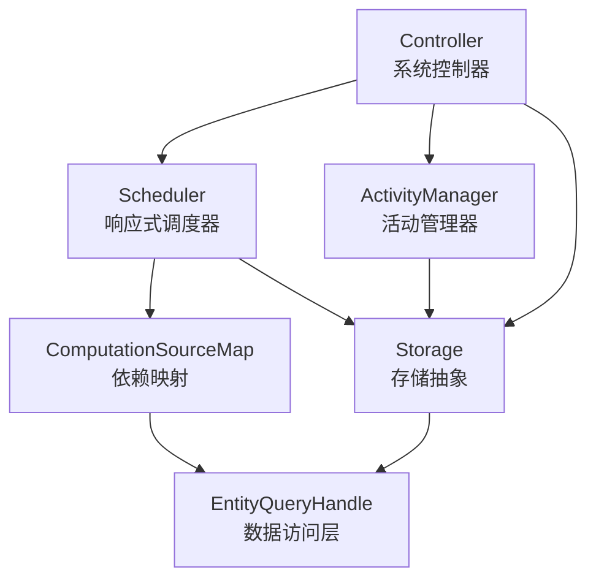

# 第1章：架构设计（Architecture）

本章详细介绍 @interaqt/runtime 框架的整体架构设计，包括模块划分、数据流向和核心组件之间的关系。

## 1.1 整体架构

### 模块划分

@interaqt/runtime 框架采用三层架构设计，每一层都有明确的职责分工：

```
┌─────────────────────────────────────────────────────────────┐
│                      Application Layer                       │
│                    (用户业务代码)                              │
└─────────────────────────────────────────────────────────────┘
                                │
┌─────────────────────────────────────────────────────────────┐
│                      Runtime Layer                          │
│  ┌─────────────┐  ┌─────────────┐  ┌─────────────────────┐  │
│  │ Controller  │  │ Scheduler   │  │ ActivityManager     │  │
│  │             │  │             │  │                     │  │
│  │ - 协调各层   │  │ - 响应式计算 │  │ - 活动状态管理       │  │
│  │ - 交互调用   │  │ - 依赖追踪   │  │ - 交互编排          │  │
│  │ - 事务管理   │  │ - 增量计算   │  │ - 事务处理          │  │
│  └─────────────┘  └─────────────┘  └─────────────────────┘  │
└─────────────────────────────────────────────────────────────┘
                                │
┌─────────────────────────────────────────────────────────────┐
│                      Storage Layer                          │
│  ┌─────────────────┐  ┌─────────────────┐  ┌─────────────┐  │
│  │ EntityQueryHandle│  │ MatchExp        │  │ RecordQuery │  │
│  │                 │  │                 │  │             │  │
│  │ - 统一数据访问   │  │ - 查询表达式     │  │ - 查询构建   │  │
│  │ - 过滤实体支持   │  │ - 条件组合       │  │ - SQL生成    │  │
│  │ - 关系操作       │  │ - 类型安全       │  │ - 性能优化   │  │
│  └─────────────────┘  └─────────────────┘  └─────────────┘  │
└─────────────────────────────────────────────────────────────┘
                                │
┌─────────────────────────────────────────────────────────────┐
│                      Shared Layer                           │
│  ┌─────────────┐  ┌─────────────┐  ┌─────────────────────┐  │
│  │ Entity      │  │ Activity    │  │ ComputedData        │  │
│  │ Property    │  │ Interaction │  │ Attributive         │  │
│  │ Relation    │  │ Transfer    │  │ BoolExp             │  │
│  └─────────────┘  └─────────────┘  └─────────────────────┘  │
└─────────────────────────────────────────────────────────────┘
                                │
┌─────────────────────────────────────────────────────────────┐
│                    Database Layer                           │
│          SQLite │ PostgreSQL │ MySQL │ PGLite              │
└─────────────────────────────────────────────────────────────┘
```

### 数据流

框架中的数据流遵循响应式编程范式，数据变化自动触发相关计算：

```
用户交互 (Interaction)
        │
        ▼
┌─────────────────┐
│ ActivityManager │ ◄─── 权限检查 (Attributive)
│                 │
│ - 验证权限       │
│ - 执行业务逻辑   │
│ - 生成变更事件   │
└─────────────────┘
        │
        ▼ (RecordMutationEvent)
┌─────────────────┐
│ Storage Layer   │
│                 │
│ - 持久化数据     │
│ - 触发变更事件   │
└─────────────────┘
        │
        ▼ (MutationEvent)
┌─────────────────┐
│ Scheduler       │
│                 │
│ - 依赖分析       │
│ - 计算调度       │
│ - 增量更新       │
└─────────────────┘
        │
        ▼ (ComputationResult)
┌─────────────────┐
│ Controller      │
│                 │
│ - 应用计算结果   │
│ - 更新存储       │
│ - 触发副作用     │
└─────────────────┘
```

### 核心组件关系



## 1.2 Runtime 模块

Runtime 模块是框架的核心执行引擎，负责响应式计算、交互处理和活动管理。

### 响应式引擎设计

响应式引擎的核心是 **Scheduler**，它实现了完整的响应式计算机制：

```typescript
// 核心组件关系
export class Scheduler {
    computations = new Set<Computation>()
    private sourceMapManager: ComputationSourceMapManager
    
    constructor(
        public controller: Controller,
        entities: KlassInstance<typeof Entity>[],
        relations: KlassInstance<typeof Relation>[],
        dict: KlassInstance<typeof Property>[]
    ) {
        // 扫描所有实体、关系和字典中的计算定义
        // 为每个计算创建对应的 Computation 实例
        // 建立数据依赖关系映射
    }
}
```

**响应式计算的核心机制：**

1. **依赖收集**：在系统初始化时，Scheduler 扫描所有的计算定义，建立 `DataDep` 依赖关系
2. **变更监听**：通过 `ComputationSourceMapManager` 监听数据变更事件
3. **增量计算**：当数据变更时，只重新计算受影响的部分
4. **结果应用**：将计算结果应用到存储层

### 调度器（Scheduler）

Scheduler 是响应式引擎的核心，负责：

#### 计算发现和注册
```typescript
// 从实体定义中发现计算
entities.forEach(entity => {
    if (entity.computedData) {
        // 实体级别的计算
        computationInputs.push({
            dataContext: {type: 'entity', id: entity},
            args: entity.computedData
        })
    }
    
    // 属性级别的计算
    entity.properties?.forEach(property => {
        if (property.computedData) {
            computationInputs.push({
                dataContext: {type: 'property', host: entity, id: property.name},
                args: property.computedData
            })
        }
    })
})
```

#### 依赖关系建立
```typescript
// 为每个计算建立依赖关系
for(const computationInput of computationInputs) {
    const ComputationCtor = ComputedDataHandle.Handles.get(args.constructor)![dataContext.type]
    const computation = new ComputationCtor(this.controller, args, dataContext)
    
    // 注册到调度器
    this.computations.add(computation)
}
```

#### 异步计算支持
框架支持异步计算，Scheduler 会为异步计算自动创建任务表：

```typescript
if(this.isAsyncComputation(computation)) {
    // 为异步计算创建专门的任务实体
    const AsyncTaskEntity = Entity.create({
        name: this.getAsyncTaskRecordKey(computation),
        properties: [
            Property.create({ name: 'status', type: 'string' }),
            Property.create({ name: 'args', type: 'json' }),
            Property.create({ name: 'result', type: 'json' })
        ]
    })
}
```

### 控制器（Controller）

Controller 是系统的总协调者，连接各个模块：

```typescript
export class Controller {
    public scheduler: Scheduler
    public activityManager: ActivityManager
    
    constructor(
        public system: System,
        public entities: KlassInstance<typeof Entity>[],
        public relations: KlassInstance<typeof Relation>[],
        public activities: KlassInstance<typeof Activity>[],
        public interactions: KlassInstance<typeof Interaction>[]
    ) {
        this.activityManager = new ActivityManager(this, activities, interactions)
        this.scheduler = new Scheduler(this, entities, relations, dict)
    }
}
```

**Controller 的核心职责：**

1. **系统初始化**：协调各模块的初始化过程
2. **交互调用**：处理用户交互请求
3. **计算结果应用**：将响应式计算结果应用到存储
4. **事务管理**：确保数据一致性
5. **副作用处理**：执行计算产生的副作用

#### 计算结果处理
```typescript
async applyResult(dataContext: DataContext, result: any, record?: any) {
    if (dataContext.type === 'global') {
        return this.system.storage.set('state', dataContext.id as string, result)
    } else if (dataContext.type === 'entity') {
        // 实体级别计算结果的应用
        const items = Array.isArray(result) ? result : [result]
        for (const item of items) {
            await this.system.storage.create(entityContext.id.name, item)
        }
    } else if (dataContext.type === 'property') {
        // 属性级别计算结果的应用
        const propertyDataContext = dataContext as PropertyDataContext
        await this.system.storage.update(
            propertyDataContext.host.name, 
            BoolExp.atom({key: 'id', value: ['=', record.id]}), 
            {[propertyDataContext.id]: result}
        )
    }
}
```

### 活动管理器（ActivityManager）

ActivityManager 负责复杂业务流程的管理：

```typescript
export class ActivityManager {
    public activityCalls = new Map<string, ActivityCall>()
    public interactionCalls = new Map<string, InteractionCall>()
    
    constructor(
        private controller: Controller,
        activities: KlassInstance<typeof Activity>[],
        interactions: KlassInstance<typeof Interaction>[]
    ) {
        // 初始化活动调用器
        activities.forEach(activity => {
            const activityCall = new ActivityCall(activity, controller)
            this.activityCalls.set(activity.uuid, activityCall)
        })
        
        // 初始化交互调用器
        interactions.forEach(interaction => {
            const interactionCall = new InteractionCall(interaction, controller)
            this.interactionCalls.set(interaction.uuid, interactionCall)
        })
    }
}
```

**ActivityManager 的核心功能：**

1. **交互编排**：管理交互之间的执行顺序和依赖关系
2. **状态管理**：维护活动的执行状态
3. **事务处理**：确保活动执行的原子性
4. **错误处理**：处理活动执行过程中的异常情况

#### 交互调用处理
```typescript
async callInteraction(interactionId: string, args: InteractionEventArgs): Promise<InteractionCallResponse> {
    const interactionCall = this.interactionCalls.get(interactionId)
    
    // 开始事务
    await this.controller.system.storage.beginTransaction(interactionCall.interaction.name)
    
    try {
        const result = await interactionCall.call(args)
        await this.controller.system.storage.commitTransaction(interactionCall.interaction.name)
        await this.runRecordChangeSideEffects(result, logger)
        return result
    } catch (error) {
        await this.controller.system.storage.rollbackTransaction(interactionCall.interaction.name)
        throw error
    }
}
```

## 1.3 Storage 模块

Storage 模块提供了统一的数据访问接口，支持多种数据库后端。

### ORM 设计

框架实现了一个轻量级的 ORM 系统，核心组件包括：

#### EntityQueryHandle - 统一数据访问接口
```typescript
export class EntityQueryHandle {
    constructor(public map: EntityToTableMap, public database: Database) {
        this.agent = new RecordQueryAgent(map, database)
    }
    
    // 统一的 CRUD 接口
    async find(entityName: string, matchExpression?: MatchExpressionData, modifier?: ModifierData, attributeQuery?: AttributeQueryData): Promise<Record[]>
    async findOne(entityName: string, matchExpression?: MatchExpressionData, modifier?: ModifierData, attributeQuery?: AttributeQueryData)
    async create(entityName: string, rawData: RawEntityData, events?: RecordMutationEvent[]): Promise<EntityIdRef>
    async update(entity: string, matchExpression: MatchExpressionData, rawData: RawEntityData, events?: RecordMutationEvent[])
    async delete(entityName: string, matchExpression: MatchExpressionData, events?: RecordMutationEvent[])
}
```

#### EntityToTableMap - 实体到表的映射
负责将实体定义映射到数据库表结构：

```typescript
// 实体映射信息
type RecordInfo = {
    name: string
    tableName: string
    fields: FieldInfo[]
    // 过滤实体相关
    sourceRecordName?: string
    filterCondition?: any
    filteredBy?: RecordInfo[]
}
```

#### 过滤实体（Filtered Entity）支持
框架原生支持过滤实体，提供了高效的数据访问：

```typescript
// 检查是否是过滤实体
isFilteredEntity(entityName: string): boolean {
    const recordInfo = this.map.getRecordInfo(entityName)
    return !!recordInfo.sourceRecordName
}

// 过滤实体的查询处理
async find(entityName: string, matchExpression?: MatchExpressionData, ...args) {
    if (this.isFilteredEntity(entityName)) {
        const config = this.getFilteredEntityConfig(entityName)
        // 将过滤条件与查询条件组合
        const combinedMatch = config.filterCondition
        if (matchExpression) {
            combinedMatch = new MatchExp(config.sourceRecordName, this.map, combinedMatch)
                .and(new MatchExp(config.sourceRecordName, this.map, matchExpression))
                .data
        }
        // 在源实体上执行查询
        return this.find(config.sourceRecordName, combinedMatch, ...args)
    }
    // 常规实体查询
    return this.agent.findRecords(entityQuery, `finding ${entityName}`)
}
```

### 查询构建器

#### MatchExp - 类型安全的查询表达式
```typescript
export class MatchExp {
    // 创建原子条件
    public static atom(condition: MatchAtom) {
        return BoolExp.atom<MatchAtom>(condition)
    }
    
    // 支持复杂的条件组合
    // 例如：age > 18 AND (city = 'Beijing' OR vip = true)
    const condition = MatchExp.atom({key: 'age', value: ['>', 18]})
        .and({key: 'city', value: ['=', 'Beijing']})
        .or({key: 'vip', value: ['=', true]})
}
```

#### 支持的查询操作符
- 比较操作：`=`, `!=`, `>`, `<`, `>=`, `<=`
- 模糊匹配：`like`
- 范围查询：`between`, `in`
- 空值检查：`not null`
- 关联查询：支持点号路径如 `user.profile.city`

### 事务管理

Storage 层提供了完整的事务支持：

```typescript
interface Storage {
    beginTransaction(transactionName?: string): Promise<any>
    commitTransaction(transactionName?: string): Promise<any>
    rollbackTransaction(transactionName?: string): Promise<any>
}
```

### 数据库适配器

框架支持多种数据库后端：

- **SQLite**：轻量级，适合开发和小型应用
- **PostgreSQL**：功能完整，适合生产环境
- **MySQL**：广泛使用的关系型数据库
- **PGLite**：浏览器中的 PostgreSQL

#### 数据库抽象接口
```typescript
export type Database = {
    open(): Promise<any>
    query<T>(sql: string, values: any[], name?: string): Promise<T[]>
    insert(sql: string, values: any[], name?: string): Promise<EntityIdRef>
    update(sql: string, values: any[], idField?: string, name?: string): Promise<EntityIdRef[]>
    delete<T>(sql: string, where: any[], name?: string): Promise<T[]>
    scheme(sql: string, name?: string): Promise<any>
    close(): Promise<any>
    
    // 数据库特定的功能
    parseMatchExpression?(key: string, value: [string, any], fieldName: string, fieldType: string, isReferenceValue: boolean, getReferenceFieldValue: (v: string) => string, genPlaceholder: (name?: string) => string): any
    getPlaceholder?(): (name?: string) => string
    mapToDBFieldType(type: string, collection?: boolean): string
}
```

## 1.4 Shared 模块

Shared 模块定义了框架的核心数据结构和类型系统。

### 通用数据结构

#### 实体系统
```typescript
// 实体定义
const Entity = createClass({
    name: 'Entity',
    public: {
        name: { type: 'string', required: true },
        properties: { type: Property, collection: true, required: true },
        computedData: { type: [], collection: false, required: false },
        // 过滤实体字段
        sourceEntity: { type: [Entity, Relation], collection: false, required: false },
        filterCondition: { type: 'object', collection: false, required: false }
    }
})

// 属性定义
const Property = createClass({
    name: 'Property',
    public: {
        name: { type: 'string', required: true },
        type: { type: 'string', required: true },
        collection: { type: 'boolean', required: false },
        defaultValue: { type: 'function', required: false },
        computed: { type: 'function', required: false },
        computedData: { type: [], collection: false, required: false }
    }
})

// 关系定义
const Relation = createClass({
    name: 'Relation',
    public: {
        source: { type: [Entity, Relation], required: true },
        sourceProperty: { type: 'string', required: true },
        target: { type: [Entity, Relation], required: true },
        targetProperty: { type: 'string', required: true },
        type: { type: 'string', required: true }, // '1:1', '1:n', 'n:1', 'n:n'
        symmetric: { type: 'boolean', required: false },
        properties: { type: Property, collection: true, required: true }
    }
})
```

#### 活动系统
```typescript
// 交互定义
const Interaction = createClass({
    name: 'Interaction',
    public: {
        name: { type: 'string', required: true },
        action: { type: Action, required: true },
        payload: { type: Payload, collection: false },
        userAttributives: { type: [Attributives, Attributive], required: false },
        conditions: { type: [Conditions, Condition], required: false },
        sideEffects: { type: SideEffect, collection: true }
    }
})

// 活动定义
const Activity = createClass({
    name: 'Activity',
    public: {
        name: { type: 'string', required: true },
        interactions: { type: Interaction, collection: true },
        transfers: { type: Transfer, collection: true },
        groups: { type: ActivityGroup, collection: true },
        gateways: { type: Gateway, collection: true },
        events: { type: Event, collection: true }
    }
})
```

### 类型系统

框架使用 `createClass` 函数创建类型安全的类定义：

```typescript
export function createClass<T extends PublicInterface>(config: {
    name: string
    display?: (obj: any) => string
    public: T
    constraints?: { [key: string]: (thisInstance: object, allInstances: object[]) => boolean }
}): Klass<T>
```

**类型系统的特点：**

1. **运行时类型检查**：确保数据结构的正确性
2. **约束验证**：支持自定义约束条件
3. **序列化支持**：自动处理对象序列化和反序列化
4. **引用关系**：自动处理对象间的引用关系

### 工具函数

#### BoolExp - 布尔表达式构建器
```typescript
export class BoolExp<T> {
    static atom<T>(data: T): BoolExp<T>
    and(data: T | BoolExp<T>): BoolExp<T>
    or(data: T | BoolExp<T>): BoolExp<T>
    map<U>(mapper: (exp: BoolExp<T>) => U): BoolExp<U>
}
```

#### Attributive - 权限定语系统
```typescript
const Attributive = createClass({
    name: 'Attributive',
    public: {
        name: { type: 'string' },
        content: { type: 'function', required: true },
        isRef: { type: 'boolean' }
    }
})
```

## 架构设计的核心优势

### 1. 响应式编程范式
- **自动依赖追踪**：系统自动分析数据依赖关系
- **增量计算**：只重新计算受影响的部分，提高性能
- **声明式编程**：开发者只需描述"是什么"，而不是"怎么做"

### 2. 模块化设计
- **职责分离**：每个模块都有明确的职责边界
- **可扩展性**：支持自定义计算类型和数据库适配器
- **可测试性**：模块间松耦合，便于单元测试

### 3. 类型安全
- **编译时检查**：TypeScript 提供静态类型检查
- **运行时验证**：`createClass` 提供运行时类型验证
- **约束系统**：支持自定义业务约束

### 4. 高性能
- **增量计算**：避免不必要的重复计算
- **查询优化**：智能的 SQL 生成和优化
- **缓存机制**：多层缓存提高数据访问效率

### 5. 开发体验
- **声明式API**：简洁直观的 API 设计
- **错误处理**：完善的错误提示和调试信息
- **文档完整**：详细的 API 文档和使用示例

这种架构设计使得 @interaqt/runtime 既保持了高性能和可扩展性，又提供了优秀的开发体验，是一个真正适合企业级应用的响应式后端框架。 