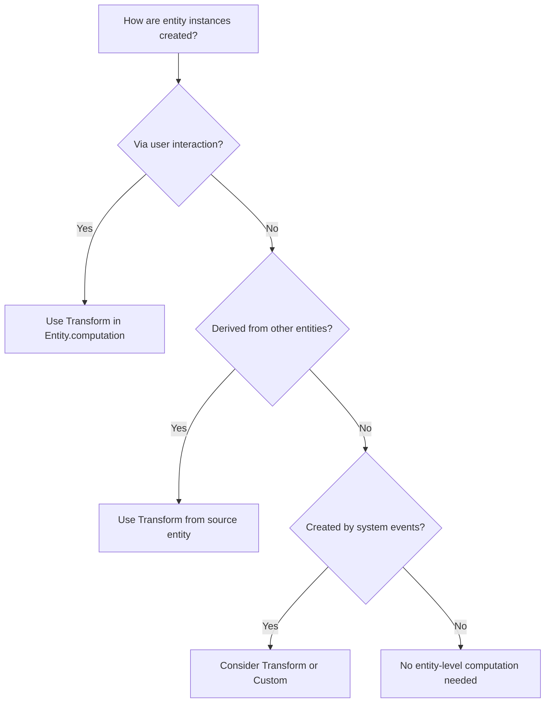
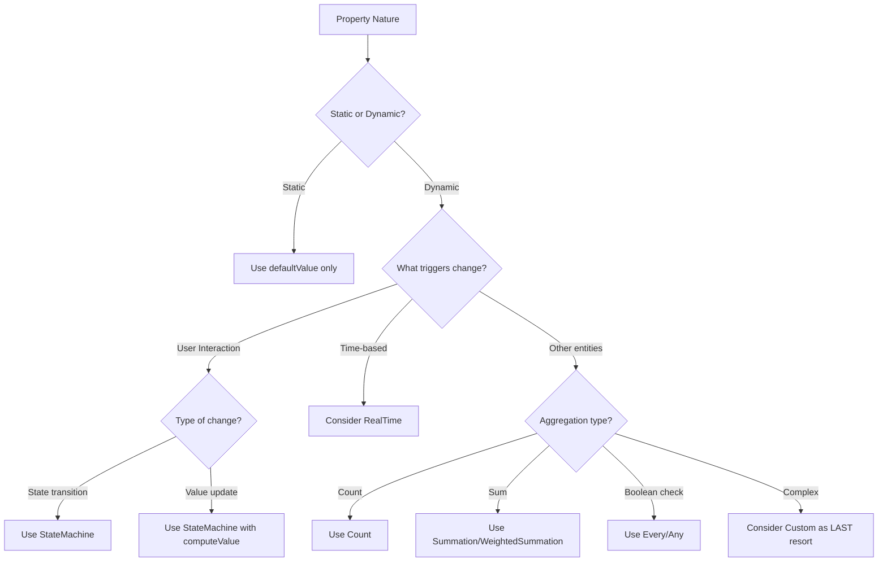

# Computation Selection Guide for LLMs

## Overview

This guide provides a systematic approach for Large Language Models to analyze entities and properties to select the appropriate computation type. You MUST follow this process for EVERY entity and EVERY property, documenting your analysis in a structured format.

**Note**: When implementing computations, remember to import necessary types:
```typescript
import { Entity, Property, Relation, Count, Summation, WeightedSummation, 
         Every, Any, Transform, StateMachine, StateNode, StateTransfer, 
         RealTime, Expression, Dictionary, Custom } from 'interaqt';
```

## Computation Types Overview

Before analyzing, understand ALL available computation types:

| Computation | Purpose | Where Used | Key Characteristics |
|------------|---------|------------|---------------------|
| **Transform** | Create new entities/relations | Entity/Relation computation ONLY | Can return single object, array, or null |
| **StateMachine** | Update entity states/properties | Property computation | Handles state transitions and value updates |
| **Count** | Count related entities | Property computation | Can include filter conditions |
| **Summation** | Sum numeric values | Property/Dictionary computation | Simple addition of values |
| **WeightedSummation** | Weighted sum of values | Property/Dictionary computation | Custom weight calculation |
| **Every** | Check if all records meet condition | Property computation | Boolean result |
| **Any** | Check if any record meets condition | Property computation | Boolean result |
| **computed** | Simple derived values | Property definition | Based on current record only |
| **RealTime** | Time-based calculations | Property/Dictionary computation | Returns Expression/Inequality/Equation, auto-schedules |
| **Dictionary** | Global state storage | Top-level (not in entities) | System-wide values |
| **Custom** | Complex logic (LAST RESORT) | Property/Dictionary computation | Full control but breaks declarative paradigm |

## 🔴 MANDATORY PROCESS

### Step 1: Create Analysis Document

Before implementing ANY computations, create a document at `docs/computation-analysis.md` with this structure:

```markdown
# Computation Analysis

## Entity: [EntityName]

### Entity-Level Analysis
- **Purpose**: [What this entity represents]
- **Creation Source**: [How are instances created? Via interaction/transform/etc]
- **Update Requirements**: [What fields need updates and when]
- **Deletion Strategy**: [Hard delete or soft delete with status]

### Property Analysis

#### Property: [propertyName]
- **Type**: [string/number/boolean/etc]
- **Purpose**: [What this property represents]
- **Data Source**: [Where does the value come from]
- **Update Frequency**: [Never/On specific interactions/Real-time]
- **Computation Decision**: [Selected computation type]
- **Reasoning**: [Why this computation was chosen]
- **Dependencies**: [If computation needed: List all required data - entities, relations, properties, interactions]
- **Calculation Method**: [If computation needed: Brief description of how the value is calculated]

[Repeat for each property]

### Entity Computation Decision
- **Type**: [Transform/None]
- **Source**: [InteractionEventEntity/Other entity/etc]
- **Reasoning**: [Why this computation was chosen]
- **Dependencies**: [If computation needed: List trigger events and required data]
- **Calculation Method**: [If computation needed: When and how entities are created]

[Repeat for each entity]

## Relation: [RelationName]

### Relation Analysis
- **Purpose**: [What this relation represents]
- **Creation**: [When/how the relation is created]
- **Deletion Requirements**: [Never/Hard delete when.../Soft delete when...]
- **Update Requirements**: [What properties might need updates]
- **State Management**: [If status field needed, describe states]
- **Computation Decision**: [Transform/StateMachine/None]
- **Reasoning**: [Why this computation was chosen]
- **Dependencies**: [If computation needed: Interactions, entities, existing records]
- **Calculation Method**: [If computation needed: When created, how state changes]

[Repeat for each relation]
```

## Step 2: Entity-Level Decision Tree

For EACH entity, ask these questions IN ORDER:

### Q1: How are instances of this entity created?



**Decision Rules:**
- If created via interaction → Transform with InteractionEventEntity
- If derived from other entities → Transform with source entity
- If system-generated → Evaluate case-by-case
- If created programmatically → No computation needed

### Q2: What relations does this entity have?

For EACH relation, determine:
1. Is the relation created when the entity is created? → No computation needed
2. Is the relation created later between existing entities? → Transform in Relation.computation

## Step 2.5: Relation-Level Decision Tree

For EACH relation in your system, you MUST analyze its complete lifecycle:

IF a relation needs deletion → Transform alone is NEVER sufficient!
- Transform can ONLY create, NEVER delete
- If you identify ANY deletion requirement, you CANNOT use Transform alone
```


### 🚫 COMMON MISTAKE TO AVOID

**WRONG Analysis:**
```markdown
- **Deletion Requirements**: Can be deleted when user is expelled
- **Computation Decision**: Transform ❌ WRONG!
- **Reasoning**: Relations created via interaction between existing entities
```

**Why This Is Wrong:**
- You identified deletion is needed: "Can be deleted when user is expelled"
- But you chose Transform, which CANNOT delete!
- The reasoning ignored the deletion requirement completely

**CORRECT Analysis:**
```markdown
- **Deletion Requirements**: Can be deleted when user is expelled
- **Computation Decision**: StateMachine only (or Transform + status if audit needed)
- **Reasoning**: Relations need deletion capability, Transform alone cannot delete
```

### 📋 Quick Reference Examples

| Deletion Requirements | Computation Decision | Why |
|----------------------|---------------------|------|
| "Never deleted" | Transform (if created via interaction) | Transform can handle creation-only scenarios |
| "Can be deleted when..." | StateMachine only | Need deletion capability |
| "Deleted when user expelled" | StateMachine only | Need deletion capability |
| "Removed on reassignment" | StateMachine only | Need deletion capability |
| "Deleted (audit trail needed)" | Transform + status StateMachine | Soft delete pattern |


### 🔴 Key Principle: Transform Can ONLY Create

**Remember**: Transform with InteractionEventEntity can ONLY create new records. It CANNOT:
- ❌ Update existing relations
- ❌ Delete relations
- ❌ Change relation properties

If you need to delete or update relations, you have these options:

**For Deletion:**
1. **Hard Delete (Default)**: Use StateMachine to directly delete the relation record
2. **Soft Delete (When Needed)**: Add a status property with StateMachine to mark as inactive

**Choose based on business requirements:**
- Use hard delete when you don't need audit trails or recovery
- Use soft delete when you need to maintain history or allow restoration

### Pattern 1: Relations Created with Entity (Most Common)

When relations are created automatically with entity creation:

```typescript
// Entity creation automatically creates relation
const Article = Entity.create({
  name: 'Article',
  computation: Transform.create({
    record: InteractionEventEntity,
    callback: (event) => {
      if (event.interactionName === 'CreateArticle') {
        return {
          title: event.payload.title,
          author: event.user  // ← Relation created automatically!
        };
      }
    }
  })
});

// Relation definition - usually no computation needed
const UserArticleRelation = Relation.create({
  source: User,
  target: Article,
  type: 'n:1'
  // No computation - created with Article
});
```

### Pattern 2: Relations Between Existing Entities

When connecting already existing entities (likes, follows, assignments):

```typescript
// For relations that NEVER need deletion (rare)
const UserFollowRelation = Relation.create({
  source: User,
  target: User,
  type: 'n:n',
  computation: Transform.create({
    record: InteractionEventEntity,
    callback: (event) => {
      if (event.interactionName === 'FollowUser') {
        return {
          source: event.user,
          target: { id: event.payload.targetUserId }
        };
      }
    }
  })
});
```

### Pattern 3: Relations with Lifecycle

When relations can be created AND deleted, choose between hard delete (no history) or soft delete (with audit trail):

#### Option A: Hard Delete with StateMachine Only (Default Approach)

Use when you don't need deletion history:

```typescript
// Example: User likes post (can like/unlike without history)
const existsState = StateNode.create({
  name: 'exists',
  computeValue: () => ({}) // Relation exists
});

const deletedState = StateNode.create({
  name: 'deleted', 
  computeValue: () => null // Returning null deletes the relation
});

const UserPostLikeRelation = Relation.create({
  source: User,
  target: Post,
  type: 'n:n',
  properties: [
    Property.create({
      name: 'likedAt',
      type: 'number',
      defaultValue: () => Date.now()
    })
  ],
  computation: StateMachine.create({
    states: [existsState, deletedState],
    defaultState: deletedState,
    transfers: [
      // Create relation
      StateTransfer.create({
        trigger: LikePost,
        current: deletedState,
        next: existsState,
        computeTarget: (event) => ({
          source: event.user,
          target: { id: event.payload.postId }
        })
      }),
      // Delete relation (hard delete)
      StateTransfer.create({
        trigger: UnlikePost,
        current: existsState,
        next: deletedState,
        computeTarget: async function(this: Controller, event) {
          // Find the existing relation to delete
          const relation = await this.system.storage.findOne(
            'UserPostLike',
            MatchExp.atom({
              key: 'source.id',
              value: ['=', event.user.id]
            }).and(MatchExp.atom({
              key: 'target.id', 
              value: ['=', event.payload.postId]
            })),
            undefined,
            ['*']
          );
          return relation; // Return the relation to transition to deleted state
        }
      })
    ]
  })
});
```

**Key Points for Hard Delete:**
- Use StateMachine as the relation's computation (no Transform needed)
- `computeValue: () => null` triggers actual deletion
- Both creation and deletion are handled by StateTransfers
- No status property needed

#### Option B: Soft Delete with Transform + Status StateMachine (When Audit Trail Needed)

Use when you need to maintain deletion history:

```typescript
// Example: User-Dormitory assignment with soft delete
const activeState = StateNode.create({ name: 'active' });
const inactiveState = StateNode.create({ name: 'inactive' });

const UserDormitoryRelation = Relation.create({
  source: User,
  target: Dormitory,
  type: 'n:1',
  properties: [
    Property.create({ 
      name: 'status', 
      type: 'string',
      defaultValue: () => 'active',
      computation: StateMachine.create({
        states: [activeState, inactiveState],
        defaultState: activeState,
        transfers: [
          StateTransfer.create({
            trigger: ExpelUserInteraction,
            current: activeState,
            next: inactiveState,
            computeTarget: (event) => ({
              source: { id: event.payload.userId },
              target: { id: event.payload.dormitoryId }
            })
          })
        ]
      })
    }),
    Property.create({
      name: 'assignedAt',
      type: 'number',
      defaultValue: () => Date.now()
    })
  ],
  computation: Transform.create({
    record: InteractionEventEntity,
    callback: (event) => {
      if (event.interactionName === 'AssignUserToDormitory') {
        return {
          source: { id: event.payload.userId },
          target: { id: event.payload.dormitoryId },
          status: 'active',
          assignedAt: Date.now()
        };
      }
    }
  })
});
```

### Common Relation Scenarios

| Scenario | Creation | Deletion | Pattern to Use |
|----------|----------|----------|----------------|
| Article author | With Article | Never | No computation |
| User likes post | Via interaction | Via unlike (no history needed) | StateMachine only (hard delete) |
| Order items | With Order | With Order | No computation |
| Friend request | Via interaction | Via unfriend (show history) | Transform + status StateMachine |
| User follows user | Via interaction | Via unfollow (no history) | StateMachine only (hard delete) |
| Role assignment | Via interaction | Via role change (audit needed) | Transform + status StateMachine |

### 🔴 Critical Questions for Every Relation

1. **Will this relation EVER need to be deleted?**
   - If no → Simple Transform suffices (Pattern 2)
   - If yes → Continue to question 2

2. **What business events affect this relation?**
   - List all interactions that might change/delete it
   - Each deletion interaction needs proper handling

3. **Do you need deletion history/audit trail?**
   - If no → Use hard delete with StateMachine only (Pattern 3A)
   - If yes → Use soft delete with Transform + status StateMachine (Pattern 3B)

4. **For soft delete only: How to handle inactive relations?**
   - Always filter by status='active' in queries
   - Consider creating filtered relations for active-only views

## Step 3: Property-Level Decision Tree

For EACH property in EACH entity, follow this systematic analysis:

### Q1: What is the nature of this property?



### Q2: Detailed Property Analysis Checklist

For EVERY property, answer ALL these questions:

1. **Is this a timestamp?**
   - Created timestamp? → Use `defaultValue: () => Math.floor(Date.now()/1000)`
   - Updated timestamp? → Use StateMachine with computeValue
   
2. **Is this a status/state field?**
   - Has defined states? → Use StateMachine
   - Binary active/inactive? → Use StateMachine with 2 states
   
3. **Is this a counter?**
   - Counting related entities? → Use Count
   - Counting with conditions? → Use Count with callback
   
4. **Is this a calculated sum?**
   - Simple sum? → Use Summation
   - Weighted sum? → Use WeightedSummation
   
5. **Is this a boolean aggregate?**
   - All must be true? → Use Every
   - At least one true? → Use Any
   
6. **Is this derived from current record only?**
   - Simple calculation? → Use `computed` function
   - No external dependencies? → Use `computed` function
   
   7. **Is this time-based?**
      - Needs current time? → Consider RealTime
      - Time-dependent calculations? → Use RealTime
      - Scheduled updates? → Use RealTime
      
   8. **Does this require complex logic?**
      - Try ALL other options first
      - Document why other computations don't work
      - Only then consider Custom

## Step 4: Common Patterns Recognition

### Pattern 1: CRUD Operations
```typescript
// Creation → Transform in Entity
const Article = Entity.create({
  name: 'Article',
  properties: [
    Property.create({ name: 'title', type: 'string' }),
    Property.create({ name: 'content', type: 'string' })
  ],
  computation: Transform.create({
    record: InteractionEventEntity,
    callback: (event) => {
      if (event.interactionName === 'CreateArticle') {
        return { 
          title: event.payload.title,
          content: event.payload.content
        };
      }
      return null;
    }
  })
})

// Update → StateMachine in Property
// First declare states
const initialState = StateNode.create({ name: 'initial' });
const updatedState = StateNode.create({ 
  name: 'updated',
  computeValue: () => Math.floor(Date.now()/1000)
});

Property.create({
  name: 'updatedAt',
  type: 'number',
  defaultValue: () => Math.floor(Date.now()/1000),
  computation: StateMachine.create({
    states: [initialState, updatedState],
    defaultState: initialState,
    transfers: [
      StateTransfer.create({
        trigger: UpdateArticleInteraction,
        current: initialState,
        next: updatedState
      }),
      StateTransfer.create({
        trigger: UpdateArticleInteraction,
        current: updatedState,
        next: updatedState
      })
    ]
  })
})

// Delete → StateMachine for status
const activeState = StateNode.create({ name: 'active' });
const deletedState = StateNode.create({ name: 'deleted' });

Property.create({
  name: 'status',
  type: 'string',
  defaultValue: () => 'active',
  computation: StateMachine.create({
    states: [activeState, deletedState],
    defaultState: activeState,
    transfers: [
      StateTransfer.create({
        trigger: DeleteArticleInteraction,
        current: activeState,
        next: deletedState
      })
    ]
  })
})
```

### Pattern 2: Aggregations
```typescript
// Count related records
Property.create({
  name: 'commentCount',
  type: 'number',
  defaultValue: () => 0,
  computation: Count.create({ 
    record: PostCommentRelation,
    direction: 'source'  // Count comments for this post
  })
})

// Sum values
Property.create({
  name: 'totalRevenue',
  type: 'number',
  defaultValue: () => 0,
  computation: Summation.create({
    record: OrderItemRelation,
    direction: 'source',  // Sum items for this order
    attributeQuery: [['target', { attributeQuery: ['price', 'quantity'] }]]
  })
})

// Weighted sum (quantity × price)
Property.create({
  name: 'totalAmount',
  type: 'number',
  defaultValue: () => 0,
  computation: WeightedSummation.create({
    record: OrderItemRelation,
    direction: 'source',
    attributeQuery: [['target', { attributeQuery: ['price', 'quantity'] }]],
    computeWeight: (orderItem) => {
      const item = orderItem.target;
      return (item.price || 0) * (item.quantity || 0);
    }
  })
})
```

### Pattern 3: State Management
```typescript
// Multi-state transitions
const states = [
  StateNode.create({ name: 'pending' }),
  StateNode.create({ name: 'approved' }),
  StateNode.create({ name: 'rejected' })
];

Property.create({
  name: 'status',
  computation: StateMachine.create({
    states,
    defaultState: states[0],
    transfers: [ /* ... */ ]
  })
})
```

### Pattern 4: Time-Based Calculations
```typescript
// Import Expression for RealTime computations
import { Expression } from 'interaqt';

// Real-time property - checks if user logged in within last hour
Property.create({
  name: 'isRecentlyActive',
  type: 'boolean',
  defaultValue: () => false,
  computation: RealTime.create({
    dataDeps: {
      _current: {
        type: 'property',
        attributeQuery: ['lastLoginAt']
      }
    },
    callback: async (now: Expression, dataDeps: any) => {
      const lastLogin = dataDeps._current?.lastLoginAt || 0;
      const oneHourAgo = now.subtract(3600000); // 1 hour in milliseconds
      // Return an Inequality expression for boolean result
      return Expression.number(lastLogin).gt(oneHourAgo);
    }
  })
})

// Global real-time value with Expression return type
const currentTimestamp = Dictionary.create({
  name: 'currentTimestamp',
  type: 'number',
  collection: false,
  defaultValue: () => 0,
  computation: RealTime.create({
    nextRecomputeTime: (now: number, dataDeps: any) => 1000, // Update every second
    callback: async (now: Expression, dataDeps: any) => {
      // Return current timestamp in seconds
      return now.divide(1000);
    }
  })
})

// Time-based boolean check with Inequality
const isAfterDeadline = Dictionary.create({
  name: 'isAfterDeadline',
  type: 'boolean',
  collection: false,
  defaultValue: () => false,
  computation: RealTime.create({
    dataDeps: {
      config: {
        type: 'records',
        source: ConfigEntity,
        attributeQuery: ['deadline']
      }
    },
    callback: async (now: Expression, dataDeps: any) => {
      const deadline = dataDeps.config?.[0]?.deadline || Date.now() + 86400000;
      // System will automatically recompute at deadline time
      return now.gt(deadline);
    }
  })
})

// Check for exact time conditions (e.g., exact minute boundaries)
const isExactMinute = Dictionary.create({
  name: 'isExactMinute',
  type: 'boolean',
  collection: false,
  defaultValue: () => false,
  computation: RealTime.create({
    callback: async (now: Expression, dataDeps: any) => {
      const msPerMinute = 60000;
      // Check if current time is exactly at minute boundary
      // Since there's no modulo, we use: now - floor(now/unit) * unit === 0
      const minutesSinceEpoch = now.divide(msPerMinute);
      const wholeMinutes = Math.floor(now.evaluate({now: Date.now()}) / msPerMinute);
      return minutesSinceEpoch.subtract(wholeMinutes).eq(0);
    }
  })
})
```

### Pattern 5: Global State with Dictionary
```typescript
// System-wide counter
const totalUsersDict = Dictionary.create({
  name: 'totalUsers',
  type: 'number',
  collection: false,
  defaultValue: () => 0,
  computation: Count.create({
    record: User
  })
})

// Configuration dictionary
const systemConfig = Dictionary.create({
  name: 'systemConfig',
  type: 'object',
  collection: false,
  defaultValue: () => ({
    maxUsers: 1000,
    maintenanceMode: false,
    allowRegistration: true
  })
  // No computation - manually updated via interactions
})

// Collection dictionary with Transform
const activeUserIds = Dictionary.create({
  name: 'activeUserIds',
  type: 'string',
  collection: true,
  defaultValue: () => [],
  computation: Transform.create({
    record: User,
    attributeQuery: ['id', 'lastActivityTime'],
    callback: (user) => {
      const oneHourAgo = Date.now() - 3600000;
      if (user.lastActivityTime > oneHourAgo) {
        return user.id;
      }
      return null;
    }
  })
})
```

## Step 5: Analysis Documentation Template

For EACH entity, document your analysis:

```markdown
## Entity: Order

### Entity-Level Analysis
- **Purpose**: Customer orders in the e-commerce system
- **Creation Source**: Created via CreateOrder interaction
- **Update Requirements**: Status updates, payment confirmation, shipping info
- **Deletion Strategy**: Soft delete with status (cancelled)

### Property Analysis

#### Property: id
- **Type**: string
- **Purpose**: Unique identifier
- **Data Source**: System-generated
- **Update Frequency**: Never
- **Computation Decision**: None (system handles)
- **Reasoning**: IDs are auto-generated by the framework

#### Property: orderNumber
- **Type**: string
- **Purpose**: Human-readable order reference
- **Data Source**: CreateOrder interaction (generated)
- **Update Frequency**: Never
- **Computation Decision**: None (set during creation)
- **Reasoning**: Generated once during creation, never changes

#### Property: status
- **Type**: string
- **Purpose**: Order fulfillment status
- **Data Source**: State transitions
- **Update Frequency**: On specific interactions (PayOrder, ShipOrder, DeliverOrder, CancelOrder)
- **Computation Decision**: StateMachine
- **Reasoning**: Has defined states (pending, paid, shipped, delivered, cancelled) with clear transitions
- **Dependencies**: Interactions: PayOrder, ShipOrder, DeliverOrder, CancelOrder; Current status value
- **Calculation Method**: State transitions triggered by interactions - pending→paid (PayOrder), paid→shipped (ShipOrder), shipped→delivered (DeliverOrder), any→cancelled (CancelOrder)

#### Property: totalAmount
- **Type**: number
- **Purpose**: Total order value
- **Data Source**: Sum of order items
- **Update Frequency**: When items added/removed/updated
- **Computation Decision**: WeightedSummation
- **Reasoning**: Need to calculate quantity × price for each item
- **Dependencies**: OrderItemRelation (direction: source), Item entity (price, quantity properties)
- **Calculation Method**: Sum of (item.price × item.quantity) for all related OrderItems

#### Property: itemCount
- **Type**: number
- **Purpose**: Number of items in order
- **Data Source**: Count of OrderItemRelation
- **Update Frequency**: Automatic when items added/removed
- **Computation Decision**: Count
- **Reasoning**: Direct count of related OrderItem entities
- **Dependencies**: OrderItemRelation (direction: source)
- **Calculation Method**: Count all OrderItemRelation records where this Order is the source

#### Property: updatedAt
- **Type**: number
- **Purpose**: Last modification timestamp
- **Data Source**: Any order update interaction
- **Update Frequency**: On any change
- **Computation Decision**: StateMachine with computeValue
- **Reasoning**: Updates to current timestamp on any state change
- **Dependencies**: All order-modifying interactions (UpdateOrder, PayOrder, ShipOrder, etc.)
- **Calculation Method**: Set to Date.now() whenever any state transition occurs

### Entity Computation Decision
- **Type**: Transform
- **Source**: InteractionEventEntity
- **Reasoning**: Orders are created via CreateOrder interaction
- **Dependencies**: CreateOrder interaction event, user context, payload data
- **Calculation Method**: When CreateOrder interaction fires, create new Order entity with data from event.payload

## Relation: UserOrderRelation

### Relation Analysis
- **Purpose**: Links users to their orders (order history)
- **Creation**: Created automatically when Order is created
- **Deletion Requirements**: Never deleted (maintain order history)
- **Update Requirements**: No property updates needed
- **State Management**: No status needed
- **Computation Decision**: None
- **Reasoning**: Created as part of Order creation via entity reference
- **Dependencies**: N/A (created with Order entity)
- **Calculation Method**: N/A (automatic with Order creation)

## Relation: OrderFavoriteRelation

### Relation Analysis
- **Purpose**: Users can favorite orders for quick reorder
- **Creation**: Via user interaction on existing orders
- **Deletion Requirements**: Hard delete when user unfavorites
- **Update Requirements**: No property updates
- **State Management**: No status (existence = favorited)
- **Computation Decision**: StateMachine
- **Reasoning**: Need both creation and deletion capability
- **Dependencies**: FavoriteOrder and UnfavoriteOrder interactions, existing User and Order entities
- **Calculation Method**: Create relation on FavoriteOrder interaction, delete (hard) on UnfavoriteOrder interaction

## Dictionary: DailyOrderStats

### Dictionary-Level Analysis
- **Purpose**: Daily order statistics for dashboard
- **Type**: object
- **Collection**: false
- **Update Frequency**: Real-time as orders change
- **Computation Decision**: Custom
- **Reasoning**: Complex aggregation requiring multiple calculations (count by status, total revenue, average order value)
- **Dependencies**: All Order entities, Order status property, Order totalAmount property
- **Calculation Method**: Aggregate all orders - group by status for counts, sum totalAmount for revenue, calculate average order value as revenue/count
```

## Step 6: Implementation Checklist

After analysis, implement computations following this checklist:

- [ ] All entities analyzed and documented
- [ ] All properties analyzed and documented
- [ ] Entity-level Transforms defined where needed
- [ ] Property computations implemented according to analysis
- [ ] Dependencies documented for all computations
- [ ] Calculation methods documented for all computations
- [ ] StateNode variables declared before use
- [ ] No Transform used in Property computation
- [ ] No circular dependencies
- [ ] Default values provided for all computed properties
- [ ] Analysis document saved to `docs/computation-analysis.md`

## Step 7: Validation Questions

Before finalizing, answer these questions:

1. **Have you analyzed EVERY property of EVERY entity?**
2. **Is your reasoning documented for EACH computation choice?**
3. **Did you consider simpler computations before Complex/Custom?**
4. **Are all dependencies clearly listed for each computation?**
5. **Are calculation methods described for each computation?**
6. **Are all StateNodes declared before use?**
7. **Are all Transforms in Entity/Relation computation only?**
9. **Is the analysis document complete and saved?**

## 🔴 CRITICAL REMINDERS

1. **NEVER skip the analysis phase** - Document first, implement second
2. **NEVER use Transform in Property computation** - Only in Entity/Relation
3. **NEVER jump to Custom computation** - Try all other options first
4. **ALWAYS declare StateNodes before use** - Not inside transfers
5. **ALWAYS provide defaultValue** - For all computed properties
6. **ALWAYS document your reasoning** - Future developers need to understand
7. **ALWAYS document dependencies** - List all data sources each computation needs
8. **ALWAYS describe calculation methods** - Explain how values are computed
9. **ALWAYS analyze relation lifecycle** - Consider creation, updates, AND deletion
10. **Transform can ONLY create** - If relations need deletion, use StateMachine or status field
11. **Think about business events** - What events might cause relation changes?
12. **Choose deletion strategy based on needs** - Use hard delete by default, soft delete when audit trail is required

## Example Complete Analysis

Here's an example of what a complete analysis might look like for a task management system:

```markdown
# Computation Analysis for Task Management System

## Entity: Project

### Entity-Level Analysis
- **Purpose**: Projects that contain multiple tasks
- **Creation Source**: CreateProject interaction
- **Update Requirements**: Name, description, status changes
- **Deletion Strategy**: Soft delete with status (archived)

### Property Analysis

#### Property: name
- **Type**: string
- **Purpose**: Project name
- **Data Source**: CreateProject payload
- **Update Frequency**: Via UpdateProject interaction
- **Computation Decision**: None
- **Reasoning**: Simple field updated directly

#### Property: taskCount
- **Type**: number
- **Purpose**: Number of tasks in project
- **Data Source**: Count of ProjectTaskRelation
- **Update Frequency**: Automatic when tasks created/deleted
- **Computation Decision**: Count
- **Reasoning**: Direct count of relations
- **Dependencies**: ProjectTaskRelation (direction: source)
- **Calculation Method**: Count all ProjectTaskRelation records where this Project is the source

#### Property: completionRate
- **Type**: number
- **Purpose**: Percentage of completed tasks
- **Data Source**: Calculation based on task statuses
- **Update Frequency**: When any task status changes
- **Computation Decision**: Custom
- **Reasoning**: Requires percentage calculation (completed/total), not a simple count
- **Dependencies**: ProjectTaskRelation, Task entities (status property)
- **Calculation Method**: (Count of tasks with status='completed' / Total task count) × 100

#### Property: isCompleted
- **Type**: boolean
- **Purpose**: Whether all tasks are completed
- **Data Source**: Check all related tasks
- **Update Frequency**: When any task status changes
- **Computation Decision**: Every
- **Reasoning**: Returns true only if every task is completed
- **Dependencies**: ProjectTaskRelation, Task entities (status property)
- **Calculation Method**: Check if every related Task has status === 'completed'

### Entity Computation Decision
- **Type**: Transform
- **Source**: InteractionEventEntity
- **Reasoning**: Projects created via CreateProject interaction
- **Dependencies**: CreateProject interaction event, payload data
- **Calculation Method**: When CreateProject fires, create new Project with name and description from payload

## Entity: Task

### Entity-Level Analysis
- **Purpose**: Individual tasks within projects
- **Creation Source**: CreateTask interaction
- **Update Requirements**: Title, description, assignee, status, priority
- **Deletion Strategy**: Hard delete (removed from project)

### Property Analysis

#### Property: status
- **Type**: string
- **Purpose**: Task completion status
- **Data Source**: State transitions
- **Update Frequency**: Via UpdateTaskStatus interaction
- **Computation Decision**: StateMachine
- **Reasoning**: Has defined states (todo, in_progress, review, completed)
- **Dependencies**: UpdateTaskStatus interaction, current status value
- **Calculation Method**: State transitions: todo→in_progress→review→completed, with possible back-transitions

#### Property: timeSpent
- **Type**: number
- **Purpose**: Total time worked on task (minutes)
- **Data Source**: Sum of time entries
- **Update Frequency**: When time entries added
- **Computation Decision**: Summation
- **Reasoning**: Simple sum of TimeEntry durations
- **Dependencies**: TaskTimeEntryRelation (direction: source), TimeEntry entity (duration property)
- **Calculation Method**: Sum of all related TimeEntry.duration values

#### Property: isOverdue
- **Type**: boolean
- **Purpose**: Whether task passed deadline
- **Data Source**: Comparison of current time with deadline
- **Update Frequency**: Time-based check
- **Computation Decision**: RealTime
- **Reasoning**: Depends on current time, needs periodic recomputation
- **Dependencies**: Current task deadline property, system time
- **Calculation Method**: Compare current time (now) with task deadline, return now > deadline
- **Implementation Note**: Uses RealTime with Inequality return type:
  ```typescript
  computation: RealTime.create({
    dataDeps: {
      _current: {
        type: 'property',
        attributeQuery: ['deadline']
      }
    },
    callback: async (now: Expression, dataDeps: any) => {
      const deadline = dataDeps._current?.deadline || Date.now() + 86400000;
      // Returns Inequality - system auto-schedules recomputation at deadline
      return now.gt(deadline);
    }
  })
  ```

### Entity Computation Decision
- **Type**: Transform
- **Source**: InteractionEventEntity
- **Reasoning**: Tasks created via CreateTask interaction
- **Dependencies**: CreateTask interaction event, project reference, payload data
- **Calculation Method**: When CreateTask fires, create new Task with project reference and initial status='todo'

## Relation: ProjectTaskRelation

### Relation Analysis
- **Purpose**: Links projects to their tasks
- **Creation**: Automatic when task created with project reference
- **Deletion Requirements**: Hard delete when task is deleted; soft delete when task is archived
- **Update Requirements**: No property updates needed
- **State Management**: No explicit state needed (follows task lifecycle)
- **Computation Decision**: None
- **Reasoning**: Created automatically via entity reference when Task is created; deleted when Task is deleted
- **Dependencies**: N/A (no computation needed)
- **Calculation Method**: N/A (no computation needed)

## Dictionary: SystemMetrics

### Dictionary Analysis
- **Purpose**: System-wide task metrics
- **Type**: object
- **Update Frequency**: Real-time as tasks change
- **Computation Decision**: Custom
- **Reasoning**: Complex aggregations (avg completion time, tasks by status, overdue count)
- **Dependencies**: All Task entities (status, createdAt, completedAt properties), current time
- **Calculation Method**: Aggregate all tasks - group by status, calculate average (completedAt - createdAt) for completed tasks, count tasks where deadline < now
```

## Example Analysis Output

Your final `docs/computation-analysis.md` should be comprehensive and cover EVERY entity and EVERY property. This documentation is as important as the code itself and must be maintained alongside the implementation. 