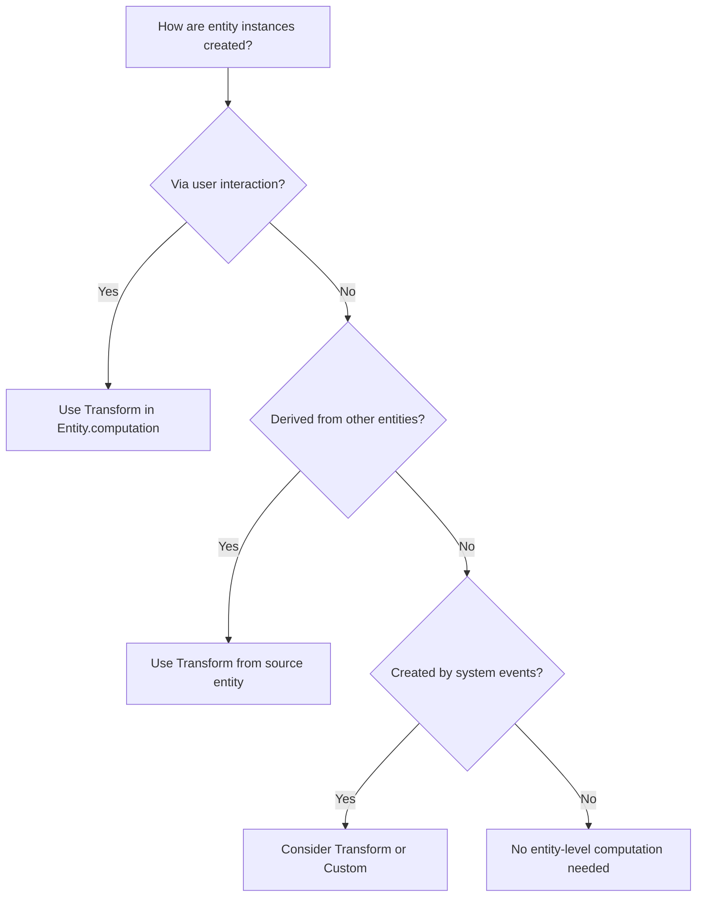
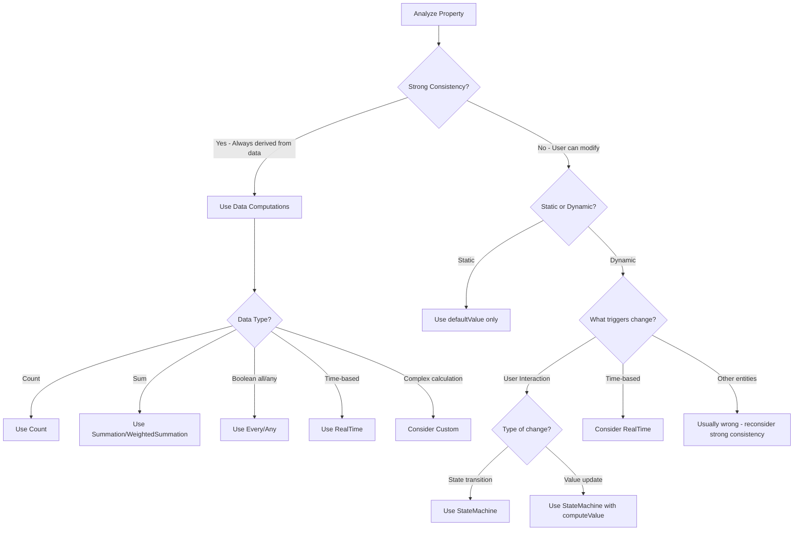

# Computation Selection Guide for LLMs

## Overview

This guide provides a systematic approach for Large Language Models to analyze entities and properties to select the appropriate computation type. You MUST follow this process for EVERY entity and EVERY property, documenting your analysis in a structured format.

**Note**: When implementing computations, remember to import necessary types:
```typescript
import { Entity, Property, Relation, Count, Summation, WeightedSummation, 
         Every, Any, Transform, StateMachine, StateNode, StateTransfer, 
         RealTime, Expression, Dictionary, Custom } from 'interaqt';
```

## Computation Types Overview

Before analyzing, understand ALL available computation types:

| Computation | Purpose | Where Used | Key Characteristics |
|------------|---------|------------|---------------------|
| **Transform** | Create new entities/relations | Entity/Relation computation ONLY | Can return single object, array, or null |
| **StateMachine** | Update entity states/properties | Property computation | Handles state transitions and value updates |
| **Count** | Count related entities | Property computation | Can include filter conditions |
| **Summation** | Sum numeric values | Property/Dictionary computation | Simple addition of values |
| **WeightedSummation** | Weighted sum of values | Property/Dictionary computation | Custom weight calculation |
| **Every** | Check if all records meet condition | Property computation | Boolean result |
| **Any** | Check if any record meets condition | Property computation | Boolean result |
| **computed** | Simple derived values | Property definition | Based on current record only |
| **RealTime** | Time-based calculations | Property/Dictionary computation | Returns Expression/Inequality/Equation, auto-schedules |
| **Dictionary** | Global state storage | Top-level (not in entities) | System-wide values |
| **Custom** | Complex logic (LAST RESORT) | Property/Dictionary computation | Full control but breaks declarative paradigm |

## 🔴 MANDATORY PROCESS

### Step 1: Create Analysis Document

Before implementing ANY computations, create a document at `docs/computation-analysis.json` with this structure:

**🔴 CRITICAL: Dependencies Format**
When documenting dependencies, use the following format:

**Basic Rules:**
- **Entity/Relation properties**: `EntityName.propertyName` or `RelationName.propertyName`
- **Self-reference properties**: Use `_self.propertyName` when a property depends on other properties of the same entity
- **Multiple properties from same entity**: List ALL separately, e.g., `["User.name", "User.email", "User.role"]`
- **Dictionary**: `DictionaryName` (without dot notation)
- **Symmetric Relations ONLY**: Use `RelationName(source)` or `RelationName(target)` to indicate direction
  - A relation is symmetric when source and target are the same entity type (e.g., User follows User)
  - Non-symmetric relations (e.g., User→Post) do NOT need direction notation
- **Interactions**: Use the interaction name directly, e.g., `CreateUser`, `UpdatePost`
- **Special entities**: `InteractionEventEntity` for interaction events

**🔴 MANDATORY: Specific Property Declaration**
- When depending on regular entities/relations, you MUST list ALL specific properties used in the computation
- ONLY exceptions: Interactions and InteractionEventEntity don't require property specification
- ❌ WRONG: `"dependencies": ["User"]` - too vague
- ✅ CORRECT: `"dependencies": ["User.name", "User.email", "User.status"]` - specific properties

Examples:
- `"dependencies": ["User.status", "User.role"]` - depends on specific User properties
- `"dependencies": ["_self.price", "_self.discountRate"]` - property depends on other properties of same entity
- `"dependencies": ["UserFollowRelation(source).time"]` - symmetric relation needs direction
- `"dependencies": ["UserPostRelation"]` - non-symmetric relation doesn't need direction
- `"dependencies": ["SystemConfig", "CreateOrder"]` - Dictionary and Interaction don't need properties

```json
{
  "entities": [
    {
      "name": "EntityName",
      "entityLevelAnalysis": {
        "purpose": "What this entity represents",
        "creationSource": "How are instances created? Via interaction/transform/etc",
        "updateRequirements": "What fields need updates and when",
        "deletionStrategy": "Hard delete or soft delete with status"
      },
      "propertyAnalysis": [
        {
          "propertyName": "propertyName",
          "type": "string/number/boolean/etc",
          "purpose": "What this property represents",
          "dataSource": "Where does the value come from",
          "updateFrequency": "Never/On specific interactions/Real-time",
          "strongConsistency": true,
          "computationDecision": "Selected computation type",
          "reasoning": "Why this computation was chosen",
          "dependencies": ["EntityName.field1", "EntityName.field2", "RelationName.propertyName", "InteractionName"],
          "calculationMethod": "Brief description of how the value is calculated"
        }
      ],
      "entityComputationDecision": {
        "type": "Transform/None",
        "source": "InteractionEventEntity/Other entity/etc",
        "reasoning": "Why this computation was chosen",
        "dependencies": ["CreateEntityInteraction", "InteractionEventEntity"],
        "calculationMethod": "When and how entities are created"
      }
    }
  ],
  "relations": [
    {
      "name": "RelationName",
      "relationAnalysis": {
        "purpose": "What this relation represents",
        "creation": "When/how the relation is created",
        "deletionRequirements": "Never/Hard delete when.../Soft delete when...",
        "updateRequirements": "What properties might need updates",
        "stateManagement": "If status field needed, describe states",
        "computationDecision": "Transform/StateMachine/None",
        "reasoning": "Why this computation was chosen",
        "dependencies": ["CreateRelationInteraction", "User.id", "Post.id"],
        "calculationMethod": "When created, how state changes"
      }
    }
  ]
}
```

## Step 2: Entity-Level Decision Tree

For EACH entity, ask these questions IN ORDER:

### Q1: How are instances of this entity created?



**Decision Rules:**
- If created via interaction → Transform with InteractionEventEntity
- If derived from other entities → Transform with source entity
- If system-generated → Evaluate case-by-case
- If created programmatically → No computation needed

### Q2: What relations does this entity have?

For EACH relation, determine:
1. Is the relation created when the entity is created? → No computation needed
2. Is the relation created later between existing entities? → Transform in Relation.computation

## Step 2.5: Relation-Level Decision Tree

For EACH relation in your system, you MUST analyze its complete lifecycle:

IF a relation needs deletion → Transform alone is NEVER sufficient!
- Transform can ONLY create, NEVER delete
- If you identify ANY deletion requirement, you CANNOT use Transform alone
```


### 🚫 COMMON MISTAKE TO AVOID

**WRONG Analysis:**
```markdown
- **Deletion Requirements**: Can be deleted when user is expelled
- **Computation Decision**: Transform ❌ WRONG!
- **Reasoning**: Relations created via interaction between existing entities
```

**Why This Is Wrong:**
- You identified deletion is needed: "Can be deleted when user is expelled"
- But you chose Transform, which CANNOT delete!
- The reasoning ignored the deletion requirement completely

**CORRECT Analysis:**
```markdown
- **Deletion Requirements**: Can be deleted when user is expelled
- **Computation Decision**: StateMachine only (or Transform + status if audit needed)
- **Reasoning**: Relations need deletion capability, Transform alone cannot delete
```

### 📋 Quick Reference Examples

| Deletion Requirements | Computation Decision | Why |
|----------------------|---------------------|------|
| "Never deleted" | Transform (if created via interaction) | Transform can handle creation-only scenarios |
| "Can be deleted when..." | StateMachine only | Need deletion capability |
| "Deleted when user expelled" | StateMachine only | Need deletion capability |
| "Removed on reassignment" | StateMachine only | Need deletion capability |
| "Deleted (audit trail needed)" | Transform + status StateMachine | Soft delete pattern |


### 🔴 Key Principle: Transform Can ONLY Create

**Remember**: Transform with InteractionEventEntity can ONLY create new records. It CANNOT:
- ❌ Update existing relations
- ❌ Delete relations
- ❌ Change relation properties

If you need to delete or update relations, you have these options:

**For Deletion:**
1. **Hard Delete (Default)**: Use StateMachine to directly delete the relation record
2. **Soft Delete (When Needed)**: Add a status property with StateMachine to mark as inactive

**Choose based on business requirements:**
- Use hard delete when you don't need audit trails or recovery
- Use soft delete when you need to maintain history or allow restoration

### Pattern 1: Relations Created with Entity (Most Common)

When relations are created automatically with entity creation:

```typescript
// Entity creation automatically creates relation
const Article = Entity.create({
  name: 'Article',
  computation: Transform.create({
    record: InteractionEventEntity,
    callback: (event) => {
      if (event.interactionName === 'CreateArticle') {
        return {
          title: event.payload.title,
          author: event.user  // ← Relation created automatically!
        };
      }
    }
  })
});

// Relation definition - usually no computation needed
const UserArticleRelation = Relation.create({
  source: User,
  target: Article,
  type: 'n:1'
  // No computation - created with Article
});
```

### Pattern 2: Relations Between Existing Entities

When connecting already existing entities (likes, follows, assignments):

```typescript
// For relations that NEVER need deletion (rare)
const UserFollowRelation = Relation.create({
  source: User,
  target: User,
  type: 'n:n',
  computation: Transform.create({
    record: InteractionEventEntity,
    callback: (event) => {
      if (event.interactionName === 'FollowUser') {
        return {
          source: event.user,
          target: { id: event.payload.targetUserId }
        };
      }
    }
  })
});
```

### Pattern 3: Relations with Lifecycle

When relations can be created AND deleted, choose between hard delete (no history) or soft delete (with audit trail):

#### Option A: Hard Delete with StateMachine Only (Default Approach)

Use when you don't need deletion history:

```typescript
// Example: User likes post (can like/unlike without history)
const existsState = StateNode.create({
  name: 'exists',
  computeValue: () => ({}) // Relation exists
});

const deletedState = StateNode.create({
  name: 'deleted', 
  computeValue: () => null // Returning null deletes the relation
});

const UserPostLikeRelation = Relation.create({
  source: User,
  target: Post,
  type: 'n:n',
  properties: [
    Property.create({
      name: 'likedAt',
      type: 'number',
      defaultValue: () => Date.now()
    })
  ],
  computation: StateMachine.create({
    states: [existsState, deletedState],
    defaultState: deletedState,
    transfers: [
      // Create relation
      StateTransfer.create({
        trigger: LikePost,
        current: deletedState,
        next: existsState,
        computeTarget: (event) => ({
          source: event.user,
          target: { id: event.payload.postId }
        })
      }),
      // Delete relation (hard delete)
      StateTransfer.create({
        trigger: UnlikePost,
        current: existsState,
        next: deletedState,
        computeTarget: async function(this: Controller, event) {
          // Find the existing relation to delete
          const relation = await this.system.storage.findOne(
            'UserPostLike',
            MatchExp.atom({
              key: 'source.id',
              value: ['=', event.user.id]
            }).and(MatchExp.atom({
              key: 'target.id', 
              value: ['=', event.payload.postId]
            })),
            undefined,
            ['*']
          );
          return relation; // Return the relation to transition to deleted state
        }
      })
    ]
  })
});
```

**Key Points for Hard Delete:**
- Use StateMachine as the relation's computation (no Transform needed)
- `computeValue: () => null` triggers actual deletion
- Both creation and deletion are handled by StateTransfers
- No status property needed

#### Option B: Soft Delete with Transform + Status StateMachine (When Audit Trail Needed)

Use when you need to maintain deletion history:

```typescript
// Example: User-Dormitory assignment with soft delete
const activeState = StateNode.create({ name: 'active' });
const inactiveState = StateNode.create({ name: 'inactive' });

const UserDormitoryRelation = Relation.create({
  source: User,
  target: Dormitory,
  type: 'n:1',
  properties: [
    Property.create({ 
      name: 'status', 
      type: 'string',
      defaultValue: () => 'active',
      computation: StateMachine.create({
        states: [activeState, inactiveState],
        defaultState: activeState,
        transfers: [
          StateTransfer.create({
            trigger: ExpelUserInteraction,
            current: activeState,
            next: inactiveState,
            computeTarget: (event) => ({
              source: { id: event.payload.userId },
              target: { id: event.payload.dormitoryId }
            })
          })
        ]
      })
    }),
    Property.create({
      name: 'assignedAt',
      type: 'number',
      defaultValue: () => Date.now()
    })
  ],
  computation: Transform.create({
    record: InteractionEventEntity,
    callback: (event) => {
      if (event.interactionName === 'AssignUserToDormitory') {
        return {
          source: { id: event.payload.userId },
          target: { id: event.payload.dormitoryId },
          status: 'active',
          assignedAt: Date.now()
        };
      }
    }
  })
});
```

### Common Relation Scenarios

| Scenario | Creation | Deletion | Pattern to Use | Symmetric? |
|----------|----------|----------|----------------|------------|
| Article author | With Article | Never | No computation | No (User→Article) |
| User likes post | Via interaction | Via unlike (no history needed) | StateMachine only (hard delete) | No (User→Post) |
| Order items | With Order | With Order | No computation | No (Order→Item) |
| Friend request | Via interaction | Via unfriend (show history) | Transform + status StateMachine | Yes (User→User)* |
| User follows user | Via interaction | Via unfollow (no history) | StateMachine only (hard delete) | Yes (User→User)* |
| Role assignment | Via interaction | Via role change (audit needed) | Transform + status StateMachine | No (User→Role) |

*Symmetric relations require direction notation in dependencies: `UserFollowRelation(source)` or `UserFollowRelation(target)`

### 🔴 Critical Questions for Every Relation

1. **Will this relation EVER need to be deleted?**
   - If no → Simple Transform suffices (Pattern 2)
   - If yes → Continue to question 2

2. **What business events affect this relation?**
   - List all interactions that might change/delete it
   - Each deletion interaction needs proper handling

3. **Do you need deletion history/audit trail?**
   - If no → Use hard delete with StateMachine only (Pattern 3A)
   - If yes → Use soft delete with Transform + status StateMachine (Pattern 3B)

4. **For soft delete only: How to handle inactive relations?**
   - Always filter by status='active' in queries
   - Consider creating filtered relations for active-only views

## Step 3: Property-Level Decision Tree

For EACH property in EACH entity, follow this systematic analysis:

### 🔴 CRITICAL FIRST QUESTION: Strong Consistency Check

**Before any other analysis, determine:**
Is this property's value ALWAYS deterministically derived from other data with no exceptions?

**Strong Consistency = YES when:**
- The value is a pure calculation from other data (count, sum, average, etc.)
- There are NO special cases where users can override the calculated value
- The relationship between input data and output value is ALWAYS the same
- Examples: totalAmount = sum of items, articleCount = count of articles, isAllCompleted = every task completed

**Strong Consistency = NO when:**
- Users can directly modify the value via interactions
- There are special cases or overrides possible
- The value represents a state that can transition independently
- Examples: status fields, user-editable fields, timestamps that can be manually set

**Decision Rule:**
- **If Strong Consistency = YES** → Use data-based computations (Count, Summation, Average, Every, Any, WeightedSummation) or Custom if no suitable computation exists
- **If Strong Consistency = NO** → Consider StateMachine for interaction-driven updates

### Q1: What is the nature of this property?



### Q2: Detailed Property Analysis Checklist

For EVERY property, answer ALL these questions:

1. **Is this a timestamp?**
   - Created timestamp? → Use `defaultValue: () => Math.floor(Date.now()/1000)`
   - Updated timestamp? → Use StateMachine with computeValue
   - Need to track WHO updated? → Use computeValue with event parameter: `(lastValue, event) => ({ timestamp: Date.now(), updatedBy: event?.user?.name })`
   
2. **Is this a status/state field?**
   - Has defined states? → Use StateMachine
   - Binary active/inactive? → Use StateMachine with 2 states
   
3. **Is this a counter?**
   - Counting related entities? → Use Count
   - Counting with conditions? → Use Count with callback
   
4. **Is this a calculated sum?**
   - Simple sum? → Use Summation
   - Weighted sum? → Use WeightedSummation
   
5. **Is this a boolean aggregate?**
   - All must be true? → Use Every
   - At least one true? → Use Any
   
6. **Is this derived from current record only?**
   - Simple calculation? → Use `computed` function
   - No external dependencies? → Use `computed` function
   
   7. **Is this time-based?**
      - Needs current time? → Consider RealTime
      - Time-dependent calculations? → Use RealTime
      - Scheduled updates? → Use RealTime
      
   8. **Does this require complex logic?**
      - Try ALL other options first
      - Document why other computations don't work
      - Only then consider Custom

## Step 4: Common Patterns Recognition

### Pattern 1: CRUD Operations
```typescript
// Creation → Transform in Entity
const Article = Entity.create({
  name: 'Article',
  properties: [
    Property.create({ name: 'title', type: 'string' }),
    Property.create({ name: 'content', type: 'string' })
  ],
  computation: Transform.create({
    record: InteractionEventEntity,
    callback: (event) => {
      if (event.interactionName === 'CreateArticle') {
        return { 
          title: event.payload.title,
          content: event.payload.content
        };
      }
      return null;
    }
  })
})

// Update → StateMachine in Property
// First declare states
const initialState = StateNode.create({ name: 'initial' });
const updatedState = StateNode.create({ 
  name: 'updated',
  computeValue: () => Math.floor(Date.now()/1000)
});

Property.create({
  name: 'updatedAt',
  type: 'number',
  defaultValue: () => Math.floor(Date.now()/1000),
  computation: StateMachine.create({
    states: [initialState, updatedState],
    defaultState: initialState,
    transfers: [
      StateTransfer.create({
        trigger: UpdateArticleInteraction,
        current: initialState,
        next: updatedState
      }),
      StateTransfer.create({
        trigger: UpdateArticleInteraction,
        current: updatedState,
        next: updatedState
      })
    ]
  })
})

// Delete → StateMachine for status
const activeState = StateNode.create({ name: 'active' });
const deletedState = StateNode.create({ name: 'deleted' });

Property.create({
  name: 'status',
  type: 'string',
  defaultValue: () => 'active',
  computation: StateMachine.create({
    states: [activeState, deletedState],
    defaultState: activeState,
    transfers: [
      StateTransfer.create({
        trigger: DeleteArticleInteraction,
        current: activeState,
        next: deletedState
      })
    ]
  })
})
```

### Pattern 2: Aggregations
```typescript
// Count related records (non-symmetric relation)
Property.create({
  name: 'commentCount',
  type: 'number',
  defaultValue: () => 0,
  computation: Count.create({ 
    property: 'comments',  // Use property name from relation
    direction: 'source'  // Count comments for this post
  })
})

// Sum values
Property.create({
  name: 'totalRevenue',
  type: 'number',
  computation: Summation.create({
    property: 'items',  // Use property name from relation
    direction: 'source',  // Sum items for this order
    attributeQuery: [['price', 'quantity']]  // Query properties on related entity
  })
})

// Weighted sum (quantity × price)
Property.create({
  name: 'totalAmount',
  type: 'number',
  computation: WeightedSummation.create({
    property: 'items',  // Use property name from relation
    direction: 'source',
    attributeQuery: ['price', 'quantity'],  // Query properties on related entity
    callback: (item) => {
      return {
        weight: item.quantity || 1,
        value: item.price || 0
      };
    }
  })
})
```

### Pattern 3: State Management
```typescript
// Multi-state transitions
const states = [
  StateNode.create({ name: 'pending' }),
  StateNode.create({ name: 'approved' }),
  StateNode.create({ name: 'rejected' })
];

Property.create({
  name: 'status',
  computation: StateMachine.create({
    states,
    defaultState: states[0],
    transfers: [ /* ... */ ]
  })
})
```

### Pattern 4: Time-Based Calculations
```typescript
// Import Expression for RealTime computations
import { Expression } from 'interaqt';

// Real-time property - checks if user logged in within last hour
Property.create({
  name: 'isRecentlyActive',
  type: 'boolean',
  computation: RealTime.create({
    dataDeps: {
      _current: {
        type: 'property',
        attributeQuery: ['lastLoginAt']
      }
    },
    callback: async (now: Expression, dataDeps: any) => {
      const lastLogin = dataDeps._current?.lastLoginAt || 0;
      const oneHourAgo = now.subtract(3600000); // 1 hour in milliseconds
      // Return an Inequality expression for boolean result
      return Expression.number(lastLogin).gt(oneHourAgo);
    }
  })
})

// Global real-time value with Expression return type
const currentTimestamp = Dictionary.create({
  name: 'currentTimestamp',
  type: 'number',
  collection: false,
  computation: RealTime.create({
    nextRecomputeTime: (now: number, dataDeps: any) => 1000, // Update every second
    callback: async (now: Expression, dataDeps: any) => {
      // Return current timestamp in seconds
      return now.divide(1000);
    }
  })
})

// Time-based boolean check with Inequality
const isAfterDeadline = Dictionary.create({
  name: 'isAfterDeadline',
  type: 'boolean',
  collection: false,
  computation: RealTime.create({
    dataDeps: {
      config: {
        type: 'records',
        source: ConfigEntity,
        attributeQuery: ['deadline']
      }
    },
    callback: async (now: Expression, dataDeps: any) => {
      const deadline = dataDeps.config?.[0]?.deadline || Date.now() + 86400000;
      // System will automatically recompute at deadline time
      return now.gt(deadline);
    }
  })
})

// Check for exact time conditions (e.g., exact minute boundaries)
const isExactMinute = Dictionary.create({
  name: 'isExactMinute',
  type: 'boolean',
  collection: false,
  computation: RealTime.create({
    callback: async (now: Expression, dataDeps: any) => {
      const msPerMinute = 60000;
      // Check if current time is exactly at minute boundary
      // Since there's no modulo, we use: now - floor(now/unit) * unit === 0
      const minutesSinceEpoch = now.divide(msPerMinute);
      const wholeMinutes = Math.floor(now.evaluate({now: Date.now()}) / msPerMinute);
      return minutesSinceEpoch.subtract(wholeMinutes).eq(0);
    }
  })
})
```

### Pattern 5: Global State with Dictionary
```typescript
// System-wide counter
const totalUsersDict = Dictionary.create({
  name: 'totalUsers',
  type: 'number',
  collection: false,
  computation: Count.create({
    record: User
  })
})

// Configuration dictionary
const systemConfig = Dictionary.create({
  name: 'systemConfig',
  type: 'object',
  collection: false,
  defaultValue: () => ({
    maxUsers: 1000,
    maintenanceMode: false,
    allowRegistration: true
  })
  // No computation - manually updated via interactions
})

// Collection dictionary with Transform
const activeUserIds = Dictionary.create({
  name: 'activeUserIds',
  type: 'string',
  collection: true,
  computation: Transform.create({
    record: User,
    attributeQuery: ['id', 'lastActivityTime'],
    callback: (user) => {
      const oneHourAgo = Date.now() - 3600000;
      if (user.lastActivityTime > oneHourAgo) {
        return user.id;
      }
      return null;
    }
  })
})
```

## Step 5: Analysis Documentation Template

For EACH entity, document your analysis:

```json
{
  "entities": [
    {
      "name": "Order",
      "entityLevelAnalysis": {
        "purpose": "Customer orders in the e-commerce system",
        "creationSource": "Created via CreateOrder interaction",
        "updateRequirements": "Status updates, payment confirmation, shipping info",
        "deletionStrategy": "Soft delete with status (cancelled)"
      },
      "propertyAnalysis": [
        {
          "propertyName": "id",
          "type": "string",
          "purpose": "Unique identifier",
          "dataSource": "System-generated",
          "updateFrequency": "Never",
          "computationDecision": "None",
          "reasoning": "IDs are auto-generated by the framework"
        },
        {
          "propertyName": "orderNumber",
          "type": "string",
          "purpose": "Human-readable order reference",
          "dataSource": "CreateOrder interaction (generated)",
          "updateFrequency": "Never",
          "computationDecision": "None",
          "reasoning": "Generated once during creation, never changes"
        },
        {
          "propertyName": "status",
          "type": "string",
          "purpose": "Order fulfillment status",
          "dataSource": "State transitions",
          "updateFrequency": "On specific interactions (PayOrder, ShipOrder, DeliverOrder, CancelOrder)",
          "strongConsistency": false,
          "computationDecision": "StateMachine",
          "reasoning": "Has defined states (pending, paid, shipped, delivered, cancelled) with clear transitions",
          "dependencies": ["PayOrder", "ShipOrder", "DeliverOrder", "CancelOrder"],
          "calculationMethod": "State transitions triggered by interactions - pending→paid (PayOrder), paid→shipped (ShipOrder), shipped→delivered (DeliverOrder), any→cancelled (CancelOrder)"
        },
        {
          "propertyName": "totalAmount",
          "type": "number",
          "purpose": "Total order value",
          "dataSource": "Sum of order items",
          "updateFrequency": "When items added/removed/updated",
          "strongConsistency": true,
          "computationDecision": "WeightedSummation",
          "reasoning": "Need to calculate quantity × price for each item",
          "dependencies": ["OrderItemRelation.status", "Item.price", "Item.quantity"],
          "calculationMethod": "Sum of (item.price × item.quantity) for all related OrderItems"
        },
        {
          "propertyName": "itemCount",
          "type": "number",
          "purpose": "Number of items in order",
          "dataSource": "Count of OrderItemRelation",
          "updateFrequency": "Automatic when items added/removed",
          "strongConsistency": true,
          "computationDecision": "Count",
          "reasoning": "Direct count of related OrderItem entities",
          "dependencies": ["OrderItemRelation"],
          "calculationMethod": "Count all OrderItemRelation records where this Order is the source"
        },
        {
          "propertyName": "updatedAt",
          "type": "number",
          "purpose": "Last modification timestamp",
          "dataSource": "Any order update interaction",
          "updateFrequency": "On any change",
          "strongConsistency": false,
          "computationDecision": "StateMachine with computeValue",
          "reasoning": "Updates to current timestamp on any state change",
          "dependencies": ["UpdateOrder", "PayOrder", "ShipOrder", "DeliverOrder", "CancelOrder"],
          "calculationMethod": "Set to Date.now() whenever any state transition occurs"
        }
      ],
      "entityComputationDecision": {
        "type": "Transform",
        "source": "InteractionEventEntity",
        "reasoning": "Orders are created via CreateOrder interaction",
        "dependencies": ["CreateOrder", "InteractionEventEntity"],
        "calculationMethod": "When CreateOrder interaction fires, create new Order entity with data from event.payload"
      }
    }
  ],
  "relations": [
    {
      "name": "UserOrderRelation",
      "relationAnalysis": {
        "purpose": "Links users to their orders (order history)",
        "creation": "Created automatically when Order is created",
        "deletionRequirements": "Never deleted (maintain order history)",
        "updateRequirements": "No property updates needed",
        "stateManagement": "No status needed",
        "computationDecision": "None",
        "reasoning": "Created as part of Order creation via entity reference",
        "dependencies": [],
        "calculationMethod": "N/A (automatic with Order creation)"
      }
    },
    {
      "name": "OrderFavoriteRelation",
      "relationAnalysis": {
        "purpose": "Users can favorite orders for quick reorder",
        "creation": "Via user interaction on existing orders",
        "deletionRequirements": "Hard delete when user unfavorites",
        "updateRequirements": "No property updates",
        "stateManagement": "No status (existence = favorited)",
        "computationDecision": "StateMachine",
        "reasoning": "Need both creation and deletion capability",
        "dependencies": ["FavoriteOrder", "UnfavoriteOrder"],
        "calculationMethod": "Create relation on FavoriteOrder interaction, delete (hard) on UnfavoriteOrder interaction"
      }
    }
  ],
  "dictionaries": [
    {
      "name": "DailyOrderStats",
      "dictionaryAnalysis": {
        "purpose": "Daily order statistics for dashboard",
        "type": "object",
        "collection": false,
        "updateFrequency": "Real-time as orders change",
        "computationDecision": "Custom",
        "reasoning": "Complex aggregation requiring multiple calculations (count by status, total revenue, average order value)",
        "dependencies": ["Order.status", "Order.totalAmount"],
        "calculationMethod": "Aggregate all orders - group by status for counts, sum totalAmount for revenue, calculate average order value as revenue/count"
      }
    }
  ]
}
```

## Step 6: Implementation Checklist

After analysis, implement computations following this checklist:

- [ ] All entities analyzed and documented
- [ ] All properties analyzed and documented
- [ ] Strong consistency determined for each property
- [ ] Entity-level Transforms defined where needed
- [ ] Property computations implemented according to analysis
- [ ] Dependencies documented for all computations
- [ ] Calculation methods documented for all computations
- [ ] StateNode variables declared before use
- [ ] No Transform used in Property computation
- [ ] No circular dependencies
- [ ] Default values provided for all computed properties
- [ ] Analysis document saved to `docs/computation-analysis.json`

## Step 7: Validation Questions

Before finalizing, answer these questions:

1. **Have you analyzed EVERY property of EVERY entity?**
2. **Did you determine strong consistency for EACH property?**
3. **Are strongly consistent properties using data-based computations (not StateMachine)?**
4. **Is your reasoning documented for EACH computation choice?**
5. **Did you consider simpler computations before Complex/Custom?**
6. **Are all dependencies clearly listed for each computation?**
7. **Are calculation methods described for each computation?**
8. **Are all StateNodes declared before use?**
9. **Are all Transforms in Entity/Relation computation only?**
10. **Is the analysis document complete and saved?**

## 🔴 CRITICAL REMINDERS

1. **NEVER skip the analysis phase** - Document first, implement second
2. **ALWAYS check strong consistency first** - Determines if value is deterministically derived from data
3. **NEVER use StateMachine for strongly consistent properties** - Use data-based computations instead
4. **NEVER use Transform in Property computation** - Only in Entity/Relation
5. **NEVER jump to Custom computation** - Try all other options first
6. **ALWAYS declare StateNodes before use** - Not inside transfers
7. **ALWAYS provide defaultValue** - For all computed properties
8. **ALWAYS document your reasoning** - Future developers need to understand
9. **ALWAYS document dependencies with specific properties** - List exact fields used, not just entity names
10. **ALWAYS describe calculation methods** - Explain how values are computed
11. **ALWAYS analyze relation lifecycle** - Consider creation, updates, AND deletion
12. **Transform can ONLY create** - If relations need deletion, use StateMachine or status field
13. **Think about business events** - What events might cause relation changes?
14. **Choose deletion strategy based on needs** - Use hard delete by default, soft delete when audit trail is required
15. **ONLY symmetric relations need direction** - Use `(source)` or `(target)` ONLY for symmetric relations
16. **Dependencies MUST be specific** - List all properties used, except for Interactions and InteractionEventEntity

## Example Complete Analysis

Here's an example of what a complete analysis might look like for a task management system:

```json
{
  "entities": [
    {
      "name": "Project",
      "entityLevelAnalysis": {
        "purpose": "Projects that contain multiple tasks",
        "creationSource": "CreateProject interaction",
        "updateRequirements": "Name, description, status changes",
        "deletionStrategy": "Soft delete with status (archived)"
      },
      "propertyAnalysis": [
        {
          "propertyName": "name",
          "type": "string",
          "purpose": "Project name",
          "dataSource": "CreateProject payload",
          "updateFrequency": "Via UpdateProject interaction",
          "computationDecision": "None",
          "reasoning": "Simple field updated directly"
        },
        {
          "propertyName": "taskCount",
          "type": "number",
          "purpose": "Number of tasks in project",
          "dataSource": "Count of ProjectTaskRelation",
          "updateFrequency": "Automatic when tasks created/deleted",
          "strongConsistency": true,
          "computationDecision": "Count",
          "reasoning": "Direct count of relations",
          "dependencies": ["ProjectTaskRelation"],
          "calculationMethod": "Count all ProjectTaskRelation records where this Project is the source"
        },
        {
          "propertyName": "completionRate",
          "type": "number",
          "purpose": "Percentage of completed tasks",
          "dataSource": "Calculation based on task statuses",
          "updateFrequency": "When any task status changes",
          "strongConsistency": true,
          "computationDecision": "Custom",
          "reasoning": "Requires percentage calculation (completed/total), not a simple count",
          "dependencies": ["ProjectTaskRelation.createdAt", "Task.status"],
          "calculationMethod": "(Count of tasks with status='completed' / Total task count) × 100"
        },
        {
          "propertyName": "isCompleted",
          "type": "boolean",
          "purpose": "Whether all tasks are completed",
          "dataSource": "Check all related tasks",
          "updateFrequency": "When any task status changes",
          "strongConsistency": true,
          "computationDecision": "Every",
          "reasoning": "Returns true only if every task is completed",
          "dependencies": ["ProjectTaskRelation.updatedAt", "Task.status"],
          "calculationMethod": "Check if every related Task has status === 'completed'"
        }
      ],
      "entityComputationDecision": {
        "type": "Transform",
        "source": "InteractionEventEntity",
        "reasoning": "Projects created via CreateProject interaction",
        "dependencies": ["CreateProject", "InteractionEventEntity"],
        "calculationMethod": "When CreateProject fires, create new Project with name and description from payload"
      }
    },
    {
      "name": "Task",
      "entityLevelAnalysis": {
        "purpose": "Individual tasks within projects",
        "creationSource": "CreateTask interaction",
        "updateRequirements": "Title, description, assignee, status, priority",
        "deletionStrategy": "Hard delete (removed from project)"
      },
      "propertyAnalysis": [
        {
          "propertyName": "status",
          "type": "string",
          "purpose": "Task completion status",
          "dataSource": "State transitions",
          "updateFrequency": "Via UpdateTaskStatus interaction",
          "strongConsistency": false,
          "computationDecision": "StateMachine",
          "reasoning": "Has defined states (todo, in_progress, review, completed)",
          "dependencies": ["UpdateTaskStatus"],
          "calculationMethod": "State transitions: todo→in_progress→review→completed, with possible back-transitions"
        },
        {
          "propertyName": "timeSpent",
          "type": "number",
          "purpose": "Total time worked on task (minutes)",
          "dataSource": "Sum of time entries",
          "updateFrequency": "When time entries added",
          "strongConsistency": true,
          "computationDecision": "Summation",
          "reasoning": "Simple sum of TimeEntry durations",
          "dependencies": ["TaskTimeEntryRelation.createAt", "TimeEntry.duration"],
          "calculationMethod": "Sum of all related TimeEntry.duration values"
        },
        {
          "propertyName": "isOverdue",
          "type": "boolean",
          "purpose": "Whether task passed deadline",
          "dataSource": "Comparison of current time with deadline",
          "updateFrequency": "Time-based check",
          "strongConsistency": true,
          "computationDecision": "RealTime",
          "reasoning": "Depends on current time, needs periodic recomputation",
          "dependencies": ["_self.deadline"],
          "calculationMethod": "Compare current time (now) with task deadline, return now > deadline",
          "implementationNote": "Uses RealTime with Inequality return type - system auto-schedules recomputation at deadline"
        }
      ],
      "entityComputationDecision": {
        "type": "Transform",
        "source": "InteractionEventEntity",
        "reasoning": "Tasks created via CreateTask interaction",
        "dependencies": ["CreateTask", "InteractionEventEntity"],
        "calculationMethod": "When CreateTask fires, create new Task with project reference and initial status='todo'"
      }
    }
  ],
  "relations": [
    {
      "name": "ProjectTaskRelation",
      "relationAnalysis": {
        "purpose": "Links projects to their tasks",
        "creation": "Automatic when task created with project reference",
        "deletionRequirements": "Hard delete when task is deleted; soft delete when task is archived",
        "updateRequirements": "No property updates needed",
        "stateManagement": "No explicit state needed (follows task lifecycle)",
        "computationDecision": "None",
        "reasoning": "Created automatically via entity reference when Task is created; deleted when Task is deleted",
        "dependencies": [],
        "calculationMethod": "N/A (no computation needed)"
      }
    }
  ],
  "dictionaries": [
    {
      "name": "SystemMetrics",
      "dictionaryAnalysis": {
        "purpose": "System-wide task metrics",
        "type": "object",
        "updateFrequency": "Real-time as tasks change",
        "computationDecision": "Custom",
        "reasoning": "Complex aggregations (avg completion time, tasks by status, overdue count)",
        "dependencies": ["Task.status", "Task.createdAt", "Task.completedAt"],
        "calculationMethod": "Aggregate all tasks - group by status, calculate average (completedAt - createdAt) for completed tasks, count tasks where deadline < now"
      }
    }
  ]
}
```

## Example Analysis Output

Your final `docs/computation-analysis.json` should be comprehensive and cover EVERY entity and EVERY property. This documentation is as important as the code itself and must be maintained alongside the implementation. 