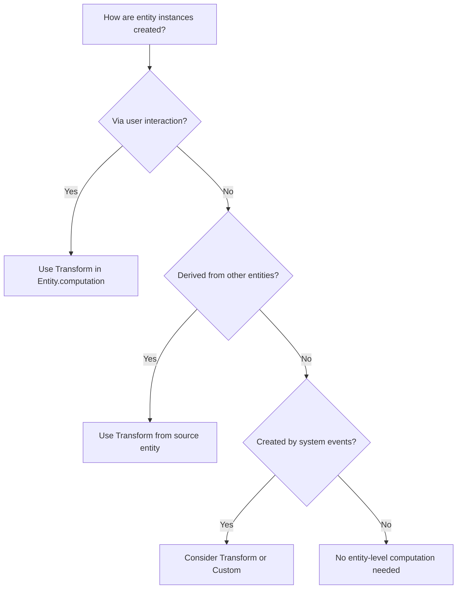
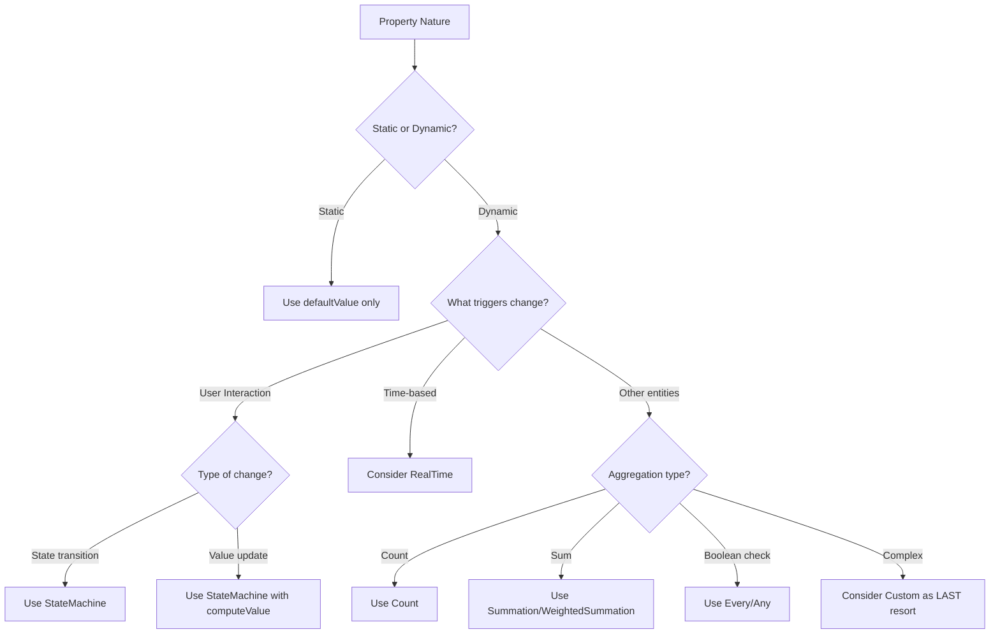

# Computation Selection Guide for LLMs

## Overview

This guide provides a systematic approach for Large Language Models to analyze entities and properties to select the appropriate computation type. You MUST follow this process for EVERY entity and EVERY property, documenting your analysis in a structured format.

**Note**: When implementing computations, remember to import necessary types:
```typescript
import { Entity, Property, Relation, Count, Summation, WeightedSummation, 
         Every, Any, Transform, StateMachine, StateNode, StateTransfer, 
         RealTime, Expression, Dictionary, Custom } from 'interaqt';
```

## Computation Types Overview

Before analyzing, understand ALL available computation types:

| Computation | Purpose | Where Used | Key Characteristics |
|------------|---------|------------|---------------------|
| **Transform** | Create new entities/relations | Entity/Relation computation ONLY | Can return single object, array, or null |
| **StateMachine** | Update entity states/properties | Property computation | Handles state transitions and value updates |
| **Count** | Count related entities | Property computation | Can include filter conditions |
| **Summation** | Sum numeric values | Property/Dictionary computation | Simple addition of values |
| **WeightedSummation** | Weighted sum of values | Property/Dictionary computation | Custom weight calculation |
| **Every** | Check if all records meet condition | Property computation | Boolean result |
| **Any** | Check if any record meets condition | Property computation | Boolean result |
| **computed** | Simple derived values | Property definition | Based on current record only |
| **RealTime** | Time-based calculations | Property/Dictionary computation | Returns Expression/Inequality/Equation, auto-schedules |
| **Dictionary** | Global state storage | Top-level (not in entities) | System-wide values |
| **Custom** | Complex logic (LAST RESORT) | Property/Dictionary computation | Full control but breaks declarative paradigm |

## 🔴 MANDATORY PROCESS

### Step 1: Create Analysis Document

Before implementing ANY computations, create a document at `docs/computation-analysis.md` with this structure:

```markdown
# Computation Analysis

## Entity: [EntityName]

### Entity-Level Analysis
- **Purpose**: [What this entity represents]
- **Creation Source**: [How are instances created? Via interaction/transform/etc]
- **Update Requirements**: [What fields need updates and when]
- **Deletion Strategy**: [Hard delete or soft delete with status]

### Property Analysis

#### Property: [propertyName]
- **Type**: [string/number/boolean/etc]
- **Purpose**: [What this property represents]
- **Data Source**: [Where does the value come from]
- **Update Frequency**: [Never/On specific interactions/Real-time]
- **Computation Decision**: [Selected computation type]
- **Reasoning**: [Why this computation was chosen]

[Repeat for each property]

### Entity Computation Decision
- **Type**: [Transform/None]
- **Source**: [InteractionEventEntity/Other entity/etc]
- **Reasoning**: [Why this computation was chosen]

[Repeat for each entity]
```

## Step 2: Entity-Level Decision Tree

For EACH entity, ask these questions IN ORDER:

### Q1: How are instances of this entity created?



**Decision Rules:**
- If created via interaction → Transform with InteractionEventEntity
- If derived from other entities → Transform with source entity
- If system-generated → Evaluate case-by-case
- If created programmatically → No computation needed

### Q2: What relations does this entity have?

For EACH relation, determine:
1. Is the relation created when the entity is created? → No computation needed
2. Is the relation created later between existing entities? → Transform in Relation.computation

## Step 3: Property-Level Decision Tree

For EACH property in EACH entity, follow this systematic analysis:

### Q1: What is the nature of this property?



### Q2: Detailed Property Analysis Checklist

For EVERY property, answer ALL these questions:

1. **Is this a timestamp?**
   - Created timestamp? → Use `defaultValue: () => Date.now()`
   - Updated timestamp? → Use StateMachine with computeValue
   
2. **Is this a status/state field?**
   - Has defined states? → Use StateMachine
   - Binary active/inactive? → Use StateMachine with 2 states
   
3. **Is this a counter?**
   - Counting related entities? → Use Count
   - Counting with conditions? → Use Count with callback
   
4. **Is this a calculated sum?**
   - Simple sum? → Use Summation
   - Weighted sum? → Use WeightedSummation
   
5. **Is this a boolean aggregate?**
   - All must be true? → Use Every
   - At least one true? → Use Any
   
6. **Is this derived from current record only?**
   - Simple calculation? → Use `computed` function
   - No external dependencies? → Use `computed` function
   
   7. **Is this time-based?**
      - Needs current time? → Consider RealTime
      - Time-dependent calculations? → Use RealTime
      - Scheduled updates? → Use RealTime
      
   8. **Does this require complex logic?**
      - Try ALL other options first
      - Document why other computations don't work
      - Only then consider Custom

## Step 4: Common Patterns Recognition

### Pattern 1: CRUD Operations
```typescript
// Creation → Transform in Entity
const Article = Entity.create({
  name: 'Article',
  properties: [
    Property.create({ name: 'title', type: 'string' }),
    Property.create({ name: 'content', type: 'string' })
  ],
  computation: Transform.create({
    record: InteractionEventEntity,
    callback: (event) => {
      if (event.interactionName === 'CreateArticle') {
        return { 
          title: event.payload.title,
          content: event.payload.content
        };
      }
      return null;
    }
  })
})

// Update → StateMachine in Property
// First declare states
const initialState = StateNode.create({ name: 'initial' });
const updatedState = StateNode.create({ 
  name: 'updated',
  computeValue: () => Date.now()
});

Property.create({
  name: 'updatedAt',
  type: 'number',
  defaultValue: () => Date.now(),
  computation: StateMachine.create({
    states: [initialState, updatedState],
    defaultState: initialState,
    transfers: [
      StateTransfer.create({
        trigger: UpdateArticleInteraction,
        current: initialState,
        next: updatedState
      }),
      StateTransfer.create({
        trigger: UpdateArticleInteraction,
        current: updatedState,
        next: updatedState
      })
    ]
  })
})

// Delete → StateMachine for status
const activeState = StateNode.create({ name: 'active' });
const deletedState = StateNode.create({ name: 'deleted' });

Property.create({
  name: 'status',
  type: 'string',
  defaultValue: () => 'active',
  computation: StateMachine.create({
    states: [activeState, deletedState],
    defaultState: activeState,
    transfers: [
      StateTransfer.create({
        trigger: DeleteArticleInteraction,
        current: activeState,
        next: deletedState
      })
    ]
  })
})
```

### Pattern 2: Aggregations
```typescript
// Count related records
Property.create({
  name: 'commentCount',
  type: 'number',
  defaultValue: () => 0,
  computation: Count.create({ 
    record: PostCommentRelation,
    direction: 'source'  // Count comments for this post
  })
})

// Sum values
Property.create({
  name: 'totalRevenue',
  type: 'number',
  defaultValue: () => 0,
  computation: Summation.create({
    record: OrderItemRelation,
    direction: 'source',  // Sum items for this order
    attributeQuery: [['target', { attributeQuery: ['price', 'quantity'] }]]
  })
})

// Weighted sum (quantity × price)
Property.create({
  name: 'totalAmount',
  type: 'number',
  defaultValue: () => 0,
  computation: WeightedSummation.create({
    record: OrderItemRelation,
    direction: 'source',
    attributeQuery: [['target', { attributeQuery: ['price', 'quantity'] }]],
    computeWeight: (orderItem) => {
      const item = orderItem.target;
      return (item.price || 0) * (item.quantity || 0);
    }
  })
})
```

### Pattern 3: State Management
```typescript
// Multi-state transitions
const states = [
  StateNode.create({ name: 'pending' }),
  StateNode.create({ name: 'approved' }),
  StateNode.create({ name: 'rejected' })
];

Property.create({
  name: 'status',
  computation: StateMachine.create({
    states,
    defaultState: states[0],
    transfers: [ /* ... */ ]
  })
})
```

### Pattern 4: Time-Based Calculations
```typescript
// Import Expression for RealTime computations
import { Expression } from 'interaqt';

// Real-time property - checks if user logged in within last hour
Property.create({
  name: 'isRecentlyActive',
  type: 'boolean',
  defaultValue: () => false,
  computation: RealTime.create({
    dataDeps: {
      _current: {
        type: 'property',
        attributeQuery: ['lastLoginAt']
      }
    },
    callback: async (now: Expression, dataDeps: any) => {
      const lastLogin = dataDeps._current?.lastLoginAt || 0;
      const oneHourAgo = now.subtract(3600000); // 1 hour in milliseconds
      // Return an Inequality expression for boolean result
      return Expression.number(lastLogin).gt(oneHourAgo);
    }
  })
})

// Global real-time value with Expression return type
const currentTimestamp = Dictionary.create({
  name: 'currentTimestamp',
  type: 'number',
  collection: false,
  defaultValue: () => 0,
  computation: RealTime.create({
    nextRecomputeTime: (now: number, dataDeps: any) => 1000, // Update every second
    callback: async (now: Expression, dataDeps: any) => {
      // Return current timestamp in seconds
      return now.divide(1000);
    }
  })
})

// Time-based boolean check with Inequality
const isAfterDeadline = Dictionary.create({
  name: 'isAfterDeadline',
  type: 'boolean',
  collection: false,
  defaultValue: () => false,
  computation: RealTime.create({
    dataDeps: {
      config: {
        type: 'records',
        source: ConfigEntity,
        attributeQuery: ['deadline']
      }
    },
    callback: async (now: Expression, dataDeps: any) => {
      const deadline = dataDeps.config?.[0]?.deadline || Date.now() + 86400000;
      // System will automatically recompute at deadline time
      return now.gt(deadline);
    }
  })
})

// Check for exact time conditions (e.g., exact minute boundaries)
const isExactMinute = Dictionary.create({
  name: 'isExactMinute',
  type: 'boolean',
  collection: false,
  defaultValue: () => false,
  computation: RealTime.create({
    callback: async (now: Expression, dataDeps: any) => {
      const msPerMinute = 60000;
      // Check if current time is exactly at minute boundary
      // Since there's no modulo, we use: now - floor(now/unit) * unit === 0
      const minutesSinceEpoch = now.divide(msPerMinute);
      const wholeMinutes = Math.floor(now.evaluate({now: Date.now()}) / msPerMinute);
      return minutesSinceEpoch.subtract(wholeMinutes).eq(0);
    }
  })
})
```

### Pattern 5: Global State with Dictionary
```typescript
// System-wide counter
const totalUsersDict = Dictionary.create({
  name: 'totalUsers',
  type: 'number',
  collection: false,
  defaultValue: () => 0,
  computation: Count.create({
    record: User
  })
})

// Configuration dictionary
const systemConfig = Dictionary.create({
  name: 'systemConfig',
  type: 'object',
  collection: false,
  defaultValue: () => ({
    maxUsers: 1000,
    maintenanceMode: false,
    allowRegistration: true
  })
  // No computation - manually updated via interactions
})

// Collection dictionary with Transform
const activeUserIds = Dictionary.create({
  name: 'activeUserIds',
  type: 'string',
  collection: true,
  defaultValue: () => [],
  computation: Transform.create({
    record: User,
    attributeQuery: ['id', 'lastActivityTime'],
    callback: (user) => {
      const oneHourAgo = Date.now() - 3600000;
      if (user.lastActivityTime > oneHourAgo) {
        return user.id;
      }
      return null;
    }
  })
})
```

## Step 5: Analysis Documentation Template

For EACH entity, document your analysis:

```markdown
## Entity: Order

### Entity-Level Analysis
- **Purpose**: Customer orders in the e-commerce system
- **Creation Source**: Created via CreateOrder interaction
- **Update Requirements**: Status updates, payment confirmation, shipping info
- **Deletion Strategy**: Soft delete with status (cancelled)

### Property Analysis

#### Property: id
- **Type**: string
- **Purpose**: Unique identifier
- **Data Source**: System-generated
- **Update Frequency**: Never
- **Computation Decision**: None (system handles)
- **Reasoning**: IDs are auto-generated by the framework

#### Property: orderNumber
- **Type**: string
- **Purpose**: Human-readable order reference
- **Data Source**: CreateOrder interaction (generated)
- **Update Frequency**: Never
- **Computation Decision**: None (set during creation)
- **Reasoning**: Generated once during creation, never changes

#### Property: status
- **Type**: string
- **Purpose**: Order fulfillment status
- **Data Source**: State transitions
- **Update Frequency**: On specific interactions (PayOrder, ShipOrder, DeliverOrder, CancelOrder)
- **Computation Decision**: StateMachine
- **Reasoning**: Has defined states (pending, paid, shipped, delivered, cancelled) with clear transitions

#### Property: totalAmount
- **Type**: number
- **Purpose**: Total order value
- **Data Source**: Sum of order items
- **Update Frequency**: When items added/removed/updated
- **Computation Decision**: WeightedSummation
- **Reasoning**: Need to calculate quantity × price for each item

#### Property: itemCount
- **Type**: number
- **Purpose**: Number of items in order
- **Data Source**: Count of OrderItemRelation
- **Update Frequency**: Automatic when items added/removed
- **Computation Decision**: Count
- **Reasoning**: Direct count of related OrderItem entities

#### Property: updatedAt
- **Type**: number
- **Purpose**: Last modification timestamp
- **Data Source**: Any order update interaction
- **Update Frequency**: On any change
- **Computation Decision**: StateMachine with computeValue
- **Reasoning**: Updates to current timestamp on any state change

### Entity Computation Decision
- **Type**: Transform
- **Source**: InteractionEventEntity
- **Reasoning**: Orders are created via CreateOrder interaction

## Dictionary: DailyOrderStats

### Dictionary-Level Analysis
- **Purpose**: Daily order statistics for dashboard
- **Type**: object
- **Collection**: false
- **Update Frequency**: Real-time as orders change
- **Computation Decision**: Custom
- **Reasoning**: Complex aggregation requiring multiple calculations (count by status, total revenue, average order value)
```

## Step 6: Implementation Checklist

After analysis, implement computations following this checklist:

- [ ] All entities analyzed and documented
- [ ] All properties analyzed and documented
- [ ] Entity-level Transforms defined where needed
- [ ] Property computations implemented according to analysis
- [ ] StateNode variables declared before use
- [ ] No Transform used in Property computation
- [ ] No circular dependencies
- [ ] Default values provided for all computed properties
- [ ] Analysis document saved to `docs/computation-analysis.md`

## Step 7: Validation Questions

Before finalizing, answer these questions:

1. **Have you analyzed EVERY property of EVERY entity?**
2. **Is your reasoning documented for EACH computation choice?**
3. **Did you consider simpler computations before Complex/Custom?**
4. **Are all StateNodes declared before use?**
5. **Are all Transforms in Entity/Relation computation only?**
6. **Have you avoided circular dependencies?**
7. **Is the analysis document complete and saved?**

## 🔴 CRITICAL REMINDERS

1. **NEVER skip the analysis phase** - Document first, implement second
2. **NEVER use Transform in Property computation** - Only in Entity/Relation
3. **NEVER jump to Custom computation** - Try all other options first
4. **ALWAYS declare StateNodes before use** - Not inside transfers
5. **ALWAYS provide defaultValue** - For all computed properties
6. **ALWAYS document your reasoning** - Future developers need to understand

## Example Complete Analysis

Here's an example of what a complete analysis might look like for a task management system:

```markdown
# Computation Analysis for Task Management System

## Entity: Project

### Entity-Level Analysis
- **Purpose**: Projects that contain multiple tasks
- **Creation Source**: CreateProject interaction
- **Update Requirements**: Name, description, status changes
- **Deletion Strategy**: Soft delete with status (archived)

### Property Analysis

#### Property: name
- **Type**: string
- **Purpose**: Project name
- **Data Source**: CreateProject payload
- **Update Frequency**: Via UpdateProject interaction
- **Computation Decision**: None
- **Reasoning**: Simple field updated directly

#### Property: taskCount
- **Type**: number
- **Purpose**: Number of tasks in project
- **Data Source**: Count of ProjectTaskRelation
- **Update Frequency**: Automatic when tasks created/deleted
- **Computation Decision**: Count
- **Reasoning**: Direct count of relations

#### Property: completionRate
- **Type**: number
- **Purpose**: Percentage of completed tasks
- **Data Source**: Calculation based on task statuses
- **Update Frequency**: When any task status changes
- **Computation Decision**: Custom
- **Reasoning**: Requires percentage calculation (completed/total), not a simple count

#### Property: isCompleted
- **Type**: boolean
- **Purpose**: Whether all tasks are completed
- **Data Source**: Check all related tasks
- **Update Frequency**: When any task status changes
- **Computation Decision**: Every
- **Reasoning**: Returns true only if every task is completed

### Entity Computation Decision
- **Type**: Transform
- **Source**: InteractionEventEntity
- **Reasoning**: Projects created via CreateProject interaction

## Entity: Task

### Entity-Level Analysis
- **Purpose**: Individual tasks within projects
- **Creation Source**: CreateTask interaction
- **Update Requirements**: Title, description, assignee, status, priority
- **Deletion Strategy**: Hard delete (removed from project)

### Property Analysis

#### Property: status
- **Type**: string
- **Purpose**: Task completion status
- **Data Source**: State transitions
- **Update Frequency**: Via UpdateTaskStatus interaction
- **Computation Decision**: StateMachine
- **Reasoning**: Has defined states (todo, in_progress, review, completed)

#### Property: timeSpent
- **Type**: number
- **Purpose**: Total time worked on task (minutes)
- **Data Source**: Sum of time entries
- **Update Frequency**: When time entries added
- **Computation Decision**: Summation
- **Reasoning**: Simple sum of TimeEntry durations

#### Property: isOverdue
- **Type**: boolean
- **Purpose**: Whether task passed deadline
- **Data Source**: Comparison of current time with deadline
- **Update Frequency**: Time-based check
- **Computation Decision**: RealTime
- **Reasoning**: Depends on current time, needs periodic recomputation
- **Implementation Note**: Uses RealTime with Inequality return type:
  ```typescript
  computation: RealTime.create({
    dataDeps: {
      _current: {
        type: 'property',
        attributeQuery: ['deadline']
      }
    },
    callback: async (now: Expression, dataDeps: any) => {
      const deadline = dataDeps._current?.deadline || Date.now() + 86400000;
      // Returns Inequality - system auto-schedules recomputation at deadline
      return now.gt(deadline);
    }
  })
  ```

### Entity Computation Decision
- **Type**: Transform
- **Source**: InteractionEventEntity
- **Reasoning**: Tasks created via CreateTask interaction

## Relation: ProjectTaskRelation

### Relation Analysis
- **Purpose**: Links projects to their tasks
- **Creation**: Automatic when task created with project reference
- **Computation Decision**: None
- **Reasoning**: Created automatically via entity reference

## Dictionary: SystemMetrics

### Dictionary Analysis
- **Purpose**: System-wide task metrics
- **Type**: object
- **Update Frequency**: Real-time as tasks change
- **Computation Decision**: Custom
- **Reasoning**: Complex aggregations (avg completion time, tasks by status, overdue count)
```

## Example Analysis Output

Your final `docs/computation-analysis.md` should be comprehensive and cover EVERY entity and EVERY property. This documentation is as important as the code itself and must be maintained alongside the implementation. 