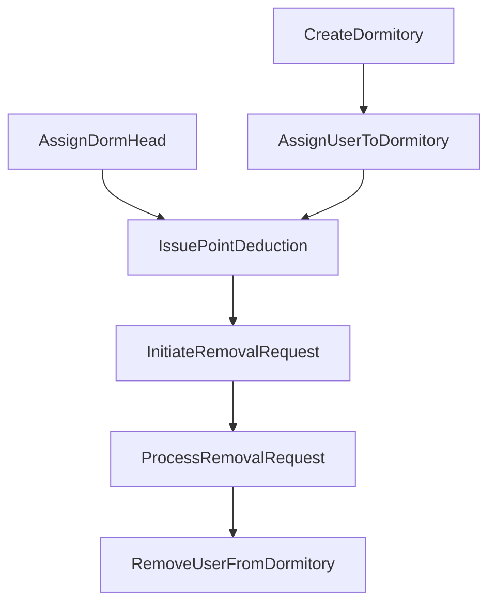

# Dormitory Management System - Interaction Matrix

## Overview

This document maps all system interactions to user roles, defining permission requirements, business rule constraints, and corresponding test cases for each interaction.

## Interaction Categories

1. **Dormitory Management**: Creating and managing dormitory entities
2. **User Management**: Assigning users, managing roles
3. **Disciplinary Actions**: Point deductions and removal processes
4. **Information Access**: Viewing and querying data

---

## Complete Interaction Matrix

| Interaction | Admin | Dorm Head | Student | Permission Rules | Business Rules | Test Cases |
|------------|--------|-----------|---------|------------------|----------------|------------|
| **CreateDormitory** | ✅ | ❌ | ❌ | Must be admin | Capacity 4-6 | TC001, TC011, TC017, TC018 |
| **UpdateDormitory** | ✅ | ❌ | ❌ | Must be admin | Valid status values | TC009 |
| **DeactivateDormitory** | ✅ | ❌ | ❌ | Must be admin | Check existing assignments | TC025 |
| **AssignDormHead** | ✅ | ❌ | ❌ | Must be admin | User must be active | TC003 |
| **RemoveDormHead** | ✅ | ❌ | ❌ | Must be admin | - | - |
| **AssignUserToDormitory** | ✅ | ❌ | ❌ | Must be admin | No existing assignment, capacity check | TC002, TC019, TC020, TC026 |
| **RemoveUserFromDormitory** | ✅ | ❌ | ❌ | Must be admin | User must be assigned | TC008 |
| **IssuePointDeduction** | ✅ | ✅* | ❌ | Admin or relevant dorm head | Points 1-10, target in dormitory | TC004, TC012, TC013, TC021, TC022 |
| **InitiateRemovalRequest** | ❌ | ✅* | ❌ | Must be dorm head of user's dorm | User has ≥30 points, no pending request | TC005, TC014, TC023, TC024 |
| **CancelRemovalRequest** | ❌ | ✅* | ❌ | Must be original requester | Request must be pending | TC010 |
| **ProcessRemovalRequest** | ✅ | ❌ | ❌ | Must be admin | Request must be pending | TC006, TC007, TC015 |
| **ViewSystemStats** | ✅ | ❌ | ❌ | Must be admin | - | - |
| **ViewDormitoryStats** | ✅ | ✅* | ❌ | Admin or dorm head of that dorm | - | - |
| **ViewUserDeductions** | ✅ | ✅* | ✅* | Varies by target | Students only see own | TC016 |
| **ViewMyDormitory** | ✅ | ✅ | ✅ | Must be authenticated | - | - |
| **ViewMyDeductions** | ✅ | ✅ | ✅ | Must be authenticated | - | - |
| **ViewMyBed** | ✅ | ✅ | ✅ | Must be authenticated | - | - |

*With restrictions as noted in Permission Rules

---

## Detailed Interaction Specifications

### 1. CreateDormitory
- **Purpose**: Create a new dormitory with beds
- **Actors**: Admin only
- **Payload**:
  - name: string (required)
  - capacity: number (required, 4-6)
  - floor: number (optional)
  - building: string (optional)
- **Permissions**: `user.role === 'admin'`
- **Business Rules**:
  - `capacity >= 4 && capacity <= 6`
  - Name must be unique
- **Side Effects**:
  - Creates dormitory entity
  - Creates bed entities (count = capacity)
  - Establishes dormitory-bed relationships
- **Error Cases**:
  - Non-admin user (permission denied)
  - Invalid capacity (validation error)
  - Duplicate name (constraint error)

### 2. AssignUserToDormitory
- **Purpose**: Assign a student to a dormitory and bed
- **Actors**: Admin only
- **Payload**:
  - userId: string (required)
  - dormitoryId: string (required)
  - bedNumber: string (required)
- **Permissions**: `user.role === 'admin'`
- **Business Rules**:
  - User must not have existing dormitory assignment
  - Dormitory must have available capacity
  - Bed must exist and be available
  - Dormitory must be active
- **Side Effects**:
  - Creates UserDormitoryRelation
  - Creates UserBedRelation
  - Updates bed status to 'occupied'
  - Updates dormitory occupancy count
- **Error Cases**:
  - User already assigned
  - Dormitory full
  - Bed not available
  - Dormitory inactive

### 3. IssuePointDeduction
- **Purpose**: Issue disciplinary points to a user
- **Actors**: Admin, Dorm Head (own dormitory only)
- **Payload**:
  - targetUserId: string (required)
  - reason: string (required)
  - points: number (required, 1-10)
  - category: string (required, enum)
  - description: string (optional)
  - evidence: string (optional)
- **Permissions**: 
  ```
  user.role === 'admin' || 
  (user.role === 'dormHead' && targetUser.dormitory === user.managedDormitory)
  ```
- **Business Rules**:
  - `points >= 1 && points <= 10`
  - Target user must be in a dormitory
  - Category must be valid enum value
- **Side Effects**:
  - Creates PointDeduction entity
  - Creates UserPointDeductionRelation
  - Creates DeductionIssuerRelation
  - Updates user's total points
  - May trigger removal eligibility
- **Error Cases**:
  - Insufficient permissions
  - Invalid point amount
  - Target not in issuer's dormitory

### 4. InitiateRemovalRequest
- **Purpose**: Request removal of a problematic user
- **Actors**: Dorm Head (own dormitory only)
- **Payload**:
  - targetUserId: string (required)
  - reason: string (required)
- **Permissions**: 
  ```
  user.role === 'dormHead' && 
  targetUser.dormitory === user.managedDormitory
  ```
- **Business Rules**:
  - Target user must have ≥30 accumulated points
  - No existing pending removal request for user
  - Target must be in requester's dormitory
- **Side Effects**:
  - Creates RemovalRequest entity
  - Creates RemovalRequestTargetRelation
  - Creates RemovalRequestInitiatorRelation
  - Computes and stores total points
- **Error Cases**:
  - Insufficient points for removal
  - Existing pending request
  - Target not in managed dormitory

### 5. ProcessRemovalRequest
- **Purpose**: Approve or reject a removal request
- **Actors**: Admin only
- **Payload**:
  - requestId: string (required)
  - decision: string (required, 'approved'|'rejected')
  - adminComment: string (optional)
- **Permissions**: `user.role === 'admin'`
- **Business Rules**:
  - Request must be in 'pending' status
  - Decision must be valid enum value
- **Side Effects (if approved)**:
  - Updates request status to 'approved'
  - Creates RemovalRequestAdminRelation
  - Updates user status to 'removed'
  - Deletes UserDormitoryRelation
  - Deletes UserBedRelation
  - Updates bed status to 'available'
  - Updates dormitory occupancy
- **Side Effects (if rejected)**:
  - Updates request status to 'rejected'
  - Creates RemovalRequestAdminRelation
  - No changes to user assignments
- **Error Cases**:
  - Non-admin user
  - Request not pending
  - Invalid decision value

### 6. ViewUserDeductions
- **Purpose**: View deduction history for a user
- **Actors**: Admin, Dorm Head (own dormitory), Student (self only)
- **Payload**:
  - targetUserId: string (required)
- **Permissions**:
  ```
  user.role === 'admin' ||
  (user.role === 'dormHead' && targetUser.dormitory === user.managedDormitory) ||
  (user.role === 'student' && targetUserId === user.id)
  ```
- **Business Rules**: None beyond permissions
- **Returns**: List of deductions with details
- **Error Cases**:
  - Unauthorized access attempt

---

## Access Control Summary

### Admin Capabilities
- Full system access
- All CRUD operations on dormitories
- User role management
- Assignment management
- Point deductions (any user)
- Process removal requests
- View all data

### Dorm Head Capabilities
- Issue deductions (own dormitory only)
- Initiate removal requests (own dormitory only)
- Cancel own removal requests
- View dormitory statistics (own dormitory)
- View user deductions (own dormitory)
- Standard user capabilities

### Student Capabilities
- View own dormitory assignment
- View own bed assignment
- View own deduction history
- No administrative actions

---

## Business Rule Validation Layers

### Layer 1: Input Validation
- Data type checking
- Required field validation
- Format validation (email, phone)
- Enum value validation

### Layer 2: Permission Checking
- Role-based access control
- Scope-based permissions (dorm heads)
- Self-access permissions (students)

### Layer 3: Business Logic Validation
- Capacity constraints
- Point thresholds
- State transition rules
- Uniqueness constraints
- Relationship constraints

### Layer 4: Consistency Validation
- No orphaned records
- Referential integrity
- State consistency
- Computed value accuracy

---

## Interaction Dependencies



---

## Testing Coverage Requirements

Each interaction must have test coverage for:
1. **Happy Path**: Valid inputs with proper permissions
2. **Permission Failures**: Each invalid role attempt
3. **Business Rule Failures**: Each constraint violation
4. **Edge Cases**: Boundary values, empty data
5. **State Transitions**: Before/after state validation
6. **Side Effects**: All related entity updates

---

## Audit Requirements

All interactions that modify data must log:
- Timestamp of action
- User who performed action
- Target entities affected
- Previous values (for updates)
- New values
- Success/failure status
- Error messages (if any)

---

## Performance Considerations

### High-Frequency Interactions
- ViewMyDormitory
- ViewMyDeductions
- ViewMyBed

**Optimization**: Cache user's current assignments

### Complex Queries
- ViewSystemStats
- ViewDormitoryStats

**Optimization**: Pre-compute aggregates, update reactively

### Bulk Operations
- Beginning of semester assignments
- End of semester removals

**Optimization**: Batch processing capabilities

---

## Future Enhancement Considerations

### Planned Interactions
- TransferUserBetweenDormitories
- AppealPointDeduction
- RequestBedChange
- ReportMaintenance
- ScheduleInspection

### Permission Evolution
- Deputy dorm heads
- Floor representatives
- Maintenance staff role

### Business Rule Evolution
- Seasonal capacity adjustments
- Point expiration system
- Probation periods
